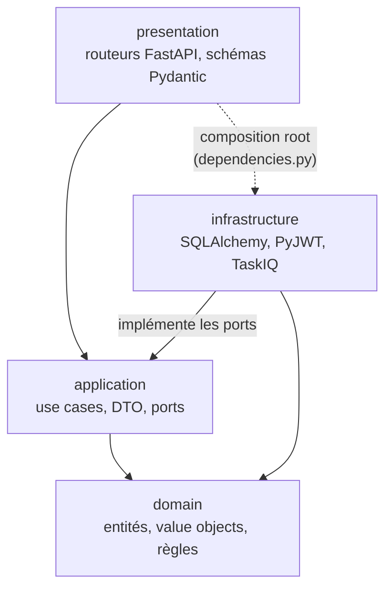

# Architecture hexagonale et DDD

## Le problème que cette architecture résout

Un logiciel de gestion de cliniques est dense en règles : quels créneaux sont
réservables, qui peut annuler et jusqu'à quand, quelles transitions d'état sont
permises pour un rendez-vous. Ces règles sont ce que le projet a de plus précieux et de
plus durable. Le framework HTTP, l'ORM et le broker de messages, eux, sont
interchangeables.

L'architecture hexagonale — aussi appelée _ports et adapters_ — consiste à **empêcher
techniquement** le mélange des deux. Concrètement : on doit pouvoir tester le calcul
d'un créneau sans démarrer PostgreSQL, et remplacer PyJWT par une autre bibliothèque
sans toucher à une seule ligne de logique métier.

## Les quatre couches

Chaque bounded context est organisé de la même façon, dans
`backend/src/vetolib/<contexte>/` :

| Couche            | Contenu                                                                     | Contrainte                   |
| ----------------- | --------------------------------------------------------------------------- | ---------------------------- |
| `domain/`         | Entités (dataclasses), value objects, erreurs, événements, ports repository | **Zéro import de framework** |
| `application/`    | Use cases, DTO figés, ports (UoW, hachage, jetons, horloge)                 | Ne connaît que `domain/`     |
| `infrastructure/` | Modèles SQLAlchemy, repositories concrets, adapters (Argon2, PyJWT, TaskIQ) | Implémente les ports         |
| `presentation/`   | Routeurs FastAPI, schémas Pydantic, dépendances                             | Assemble le tout             |

## Le sens des dépendances



Le point du diagramme est simple : **aucune flèche ne sort de `domain`**. Le domaine ne
sait pas qu'une base de données existe, ni qu'une requête HTTP existe. C'est ce qui rend
`Appointment` ou `compute_available_slots` testables en millisecondes.

La seule flèche de `presentation` vers `infrastructure` est en pointillés parce qu'elle
n'existe qu'à un endroit précis : le _composition root_, où l'on décide quelle
implémentation concrète brancher derrière chaque port. Ce sont les fichiers
`presentation/dependencies.py` de chaque contexte, et `backend/src/vetolib/main.py` pour
l'assemblage global.

## La règle « zéro import framework »

Un fichier de `domain/` n'importe ni `fastapi`, ni `sqlalchemy`, ni `pydantic`. Les
entités sont des `dataclass` Python nues :

```python
@dataclass(kw_only=True, eq=False)
class Appointment(Entity):
    clinic_id: uuid.UUID
    resource_id: uuid.UUID
    starts_at: datetime
    ends_at: datetime
    status: AppointmentStatus
```

Les value objects se valident eux-mêmes à la construction, ce qui garantit qu'un objet
invalide **ne peut pas exister** dans le système :

```python
@dataclass(frozen=True)
class Email:
    value: str

    def __post_init__(self) -> None:
        normalized = self.value.strip().lower()
        if not _EMAIL_RE.match(normalized):
            raise DomainValidationError(f"Adresse email invalide : {self.value!r}")
        object.__setattr__(self, "value", normalized)
```

`frozen=True` traduit une idée de DDD : un value object n'a pas d'identité, il **est**
sa valeur. Deux `Email` de même texte sont le même objet du point de vue métier.
La normalisation `trim + lowercase` est aussi ce qui rend fiable l'unicité en base :
`"Foo@Bar.com "` et `"foo@bar.com"` désignent le même compte.

## Ports et adapters : un exemple concret

Un **port** est une interface déclarée par la couche qui en a besoin ; un **adapter** est
son implémentation concrète, posée dans `infrastructure/`.

| Port (`application/ports.py`) | Adapter (`infrastructure/`) | Bibliothèque    |
| ----------------------------- | --------------------------- | --------------- |
| `PasswordHasher`              | `PwdlibPasswordHasher`      | pwdlib / Argon2 |
| `TokenProvider`               | `PyJWTTokenProvider`        | PyJWT           |
| `OwnerTokenProvider`          | `PyJWTOwnerTokenProvider`   | PyJWT           |
| `UnitOfWork`                  | `SqlAlchemyUnitOfWork`      | SQLAlchemy      |
| `Clock`                       | `SystemClock`               | `datetime`      |

Le port `Clock` mérite un mot : il n'existe **que** pour la testabilité. Aucun use case
n'appelle `datetime.now()` ; l'heure est toujours injectée. Les tests peuvent donc figer
le temps et vérifier qu'un rendez-vous ne s'annule plus à moins de 24 heures de son
début, sans faire dépendre le résultat de la date d'exécution de la suite.

## L'organisation « contexte d'abord »

Le découpage de premier niveau est **métier**, pas technique :

```text
backend/src/vetolib/
├── identity/          <- un contexte, avec ses 4 couches
│   ├── domain/
│   ├── application/
│   ├── infrastructure/
│   └── presentation/
├── patients/
├── scheduling/
├── billing/
└── shared/
```

Et non `domain/identity/`, `domain/scheduling/`, `infrastructure/identity/`… Ce choix
rend la frontière du contexte visible dans l'arborescence : tout ce qui concerne
l'authentification tient dans un seul dossier. Voir
[Les quatre bounded contexts](bounded-contexts.md).

## Comment cette décision est vérifiée

Elle ne repose pas sur la discipline seule :

- **mypy en mode strict** sur `src/` et `tests/` : un port mal implémenté ne compile pas ;
- **ruff** avec les règles `E,F,I,N,UP,B,ASYNC,S,T20,RUF`, dont `I` (tri des imports) qui
  rend un import de framework dans `domain/` immédiatement visible en revue ;
- **les tests unitaires** de `tests/unit/` tournent sans Docker : si un fichier de
  `domain/` se met à dépendre de SQLAlchemy, la suite unitaire cesse de passer.

Voir [ADR-0001](../adr/0001-architecture-hexagonale-et-ddd.md).
