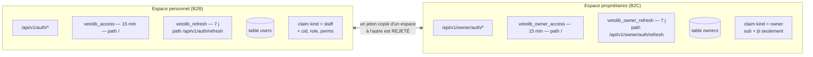
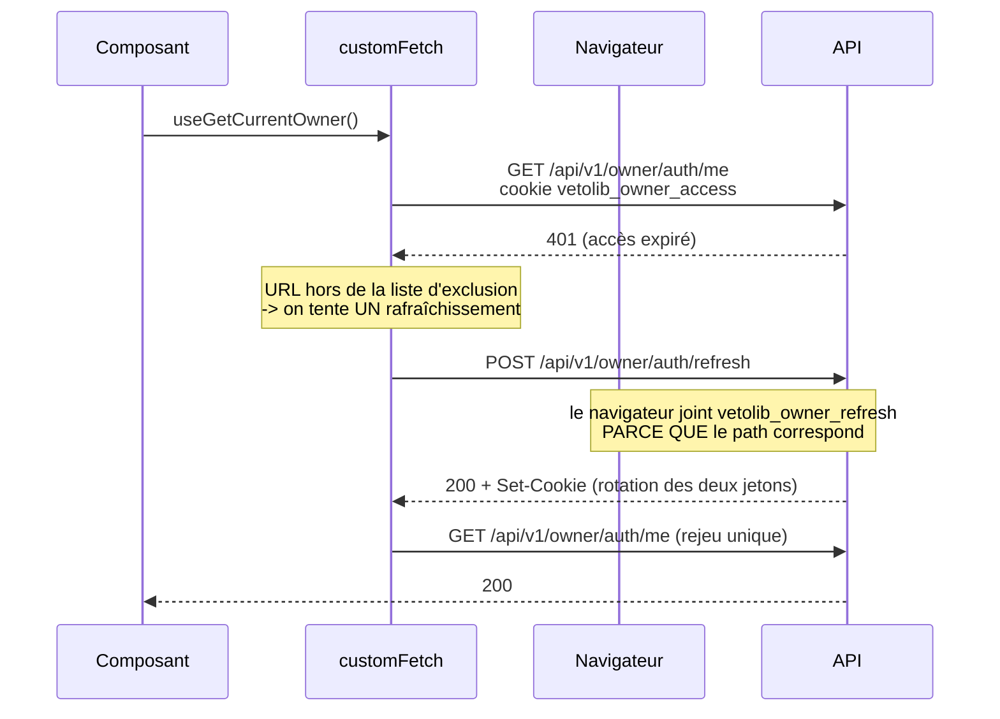

# Authentification : deux espaces cloisonnés

## Deux populations, un seul backend

VetoLib authentifie deux publics qui n'ont rien à voir :

- le **personnel de clinique** (B2B), qui appartient à une clinique et porte un rôle ;
- les **propriétaires d'animaux** (B2C), comptes globaux sans clinique ni rôle.

Le même email peut exister dans les deux mondes : une vétérinaire peut être cliente
d'une autre clinique pour son propre chat. Ce sont **deux comptes distincts**, dans deux
tables distinctes (`users` et `owners`).



## Pourquoi des cookies HttpOnly, et jamais de jeton en JSON

**Aucun jeton ne transite dans un corps JSON ni dans un en-tête posé par le frontend.**
Ils voyagent exclusivement dans des cookies `HttpOnly`.

- `HttpOnly` signifie que `document.cookie` ne voit pas le cookie. Une faille XSS dans
  l'un des portails **ne peut donc pas exfiltrer les jetons**. C'est toute la raison
  d'être du choix : le stockage en `localStorage`, lui, est lisible par n'importe quel
  script injecté.
- Le navigateur renvoie le cookie tout seul. Les hooks générés par Orval n'ont aucun
  jeton à stocker, à joindre, ni à faire expirer.

La contrepartie d'un cookie automatique est le **CSRF** : un site tiers pourrait
déclencher une requête authentifiée à l'insu de l'utilisateur. Deux garde-fous :

- `SameSite=Lax` — le cookie n'est pas envoyé sur une requête `POST` venue d'un autre
  site ;
- une liste d'origines CORS **exacte** (pas de joker), imposée par
  `allow_credentials=True`.

## Le double jeton

| Jeton            | Durée   | Cookie            | `path`                 | Contenu                                          |
| ---------------- | ------- | ----------------- | ---------------------- | ------------------------------------------------ |
| Accès            | 15 min  | `vetolib_access`  | `/`                    | « gras » côté personnel : `cid`, `role`, `perms` |
| Rafraîchissement | 7 jours | `vetolib_refresh` | `/api/v1/auth/refresh` | maigre : `sub`, `jti`                            |

Le `path` restreint du jeton de rafraîchissement est un détail à fort rendement. C'est
le jeton **le plus sensible** (7 jours), et grâce à ce `path`, le navigateur ne le joint
**jamais** aux requêtes ordinaires : il ne sort que sur son propre endpoint. Sa surface
d'exposition est donc minimale.

Le jeton d'accès du personnel est volontairement « gras » : il embarque la clinique, le
rôle et les permissions, ce qui permet d'autoriser chaque requête **sans aller en base**.
La contrepartie est explicite : une révocation ne prend effet qu'à l'expiration, d'où les
15 minutes. Le jeton de rafraîchissement, lui, est maigre : au rafraîchissement, on relit
l'utilisateur en base, et un compte désactivé ou un rôle modifié est pris en compte à ce
moment-là.

## Le claim `kind` : le verrou entre les deux espaces

Les deux espaces partagent le **même secret**, le **même émetteur** et la **même
audience**. Sans marquage, un jeton signé pour l'un serait cryptographiquement valide
pour l'autre.

Chaque jeton porte donc `kind: "staff"` ou `kind: "owner"`, vérifié au décodage :

```python
kind = claims.get("kind")
kind_ok = kind == expected_kind or (kind is None and allow_missing_kind)
if not kind_ok:
    raise InvalidTokenError("Jeton invalide pour cet espace.")
```

C'est de la défense en profondeur : les cookies ont déjà des noms distincts, et un jeton
d'accès propriétaire n'a de toute façon ni `cid` ni `role` — le retypage en
`AccessClaims` échouerait. Mais le `kind` est la barrière **officielle**, vérifiée en
premier et pour une raison explicite.

:::warning Tolérance temporaire, côté personnel uniquement
`allow_missing_kind=True` est actif pour les jetons du personnel, le temps que les
jetons de rafraîchissement émis avant l'introduction du claim expirent (7 jours). Un
`TODO` dans `identity/infrastructure/token_provider.py` marque le passage à `False`.
Côté propriétaires, `kind == "owner"` est exigé **sans tolérance** : aucun jeton
antérieur n'existe.
:::

## Deux autres contrôles au décodage

```python
claims = jwt.decode(
    token,
    secret,
    algorithms=[_ALGORITHM],
    audience=audience,
    issuer=issuer,
    options={"require": ["exp", "iat", "sub"]},
)
```

- **`algorithms` est obligatoire et fermé.** Accepter l'algorithme annoncé par le jeton
  lui-même est la faille classique `alg=none` : n'importe qui pourrait forger un jeton
  non signé.
- **Le claim `type` est vérifié séparément.** Sans ce contrôle, un jeton de
  rafraîchissement (7 jours) présenté comme un jeton d'accès serait accepté partout
  pendant une semaine.

Toute erreur PyJWT est traduite en `InvalidTokenError`, une erreur de domaine. La couche
présentation la transforme en `401` sans jamais exposer le détail technique.

## Le rafraîchissement silencieux



Trois règles encadrent ce mécanisme, décrites en détail dans
[Session et cookies côté client](../frontends/session-cote-client.md) :

1. **un seul rejeu**, jamais deux — sinon un compte réellement invalide provoquerait une
   boucle infinie ;
2. **les routes d'authentification sont exclues** (`login`, `refresh`, `logout`) : un 401
   y est une réponse normale, pas le signe d'un jeton périmé ;
3. **un mutex partage le rafraîchissement** entre tous les 401 concurrents. Comme le
   backend fait tourner le jeton de rafraîchissement, deux rafraîchissements simultanés
   s'invalideraient mutuellement.

## La déconnexion

Un cookie ne se supprime qu'en le réécrivant expiré **avec exactement les mêmes
attributs**, `path` compris. C'est pourquoi `clear_auth_cookies` répète
`path`, `httponly`, `secure` et `samesite` à l'identique de `set_auth_cookies` : un
`path` différent ne supprimerait rien du tout.

Ce module `identity/presentation/cookies.py` est **le seul endroit** du backend qui
connaît les noms et les chemins des cookies. Connexion, rafraîchissement et déconnexion
passent tous par lui, ce qui rend l'incohérence impossible par construction.

Voir [ADR-0003](../adr/0003-jwt-en-cookies-httponly.md).
