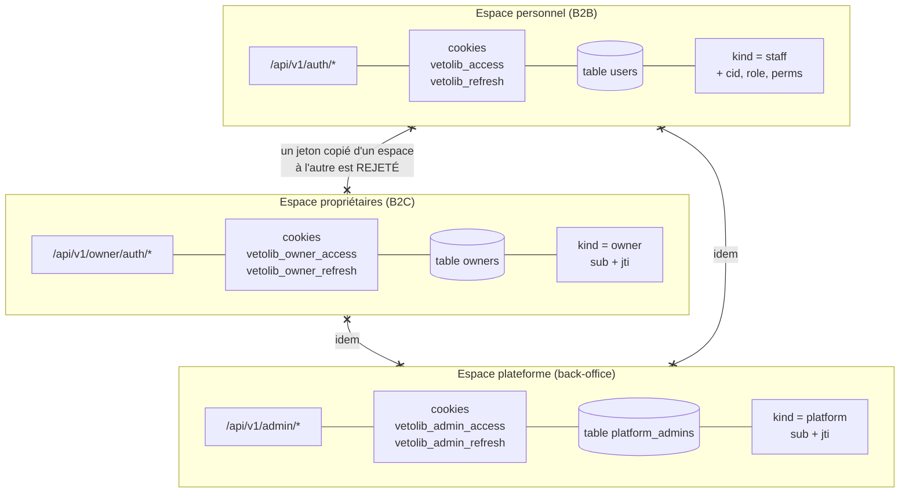
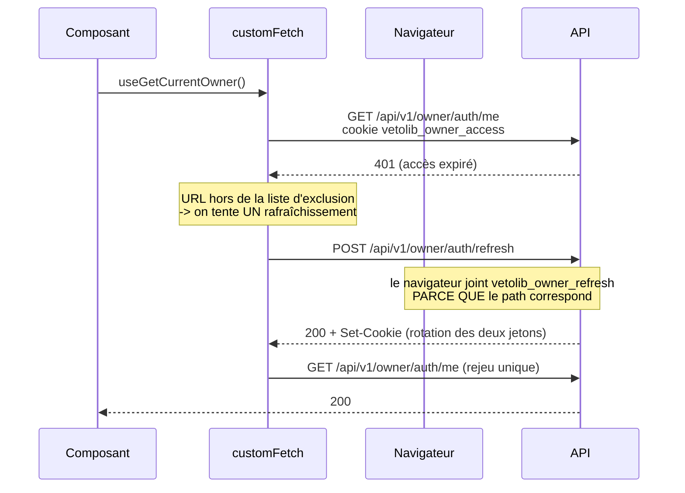
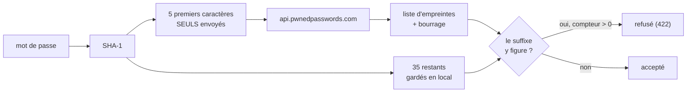

# Authentification : trois espaces cloisonnés

## Trois populations, un seul backend

VetoLib authentifie trois publics qui n'ont rien à voir :

- le **personnel de clinique** (B2B), qui appartient à une clinique et porte un rôle ;
- les **propriétaires d'animaux** (B2C), comptes globaux sans clinique ni rôle ;
- les **administrateurs de la plateforme**, les exploitants du produit, qui n'appartiennent
  à aucune clinique et les voient toutes.

Le même email peut exister dans plusieurs de ces mondes : une vétérinaire peut être cliente
d'une autre clinique pour son propre chat. Ce sont des **comptes distincts**, dans des
tables distinctes (`users`, `owners`, `platform_admins`).



## Pourquoi des cookies HttpOnly, et jamais de jeton en JSON

**Aucun jeton ne transite dans un corps JSON ni dans un en-tête posé par le frontend.**
Ils voyagent exclusivement dans des cookies `HttpOnly`.

- `HttpOnly` signifie que `document.cookie` ne voit pas le cookie. Une faille XSS dans
  l'un des portails **ne peut donc pas exfiltrer les jetons**. C'est toute la raison
  d'être du choix : le stockage en `localStorage`, lui, est lisible par n'importe quel
  script injecté.
- Le navigateur renvoie le cookie tout seul. Les hooks générés par Orval n'ont aucun
  jeton à stocker, à joindre, ni à faire expirer.

La contrepartie d'un cookie automatique est le **CSRF** : un site tiers pourrait
déclencher une requête authentifiée à l'insu de l'utilisateur. Deux garde-fous :

- `SameSite=Lax` — le cookie n'est pas envoyé sur une requête `POST` venue d'un autre
  site ;
- une liste d'origines CORS **exacte** (pas de joker), imposée par
  `allow_credentials=True`.

## Le double jeton

| Espace        | Jeton            | Durée    | Cookie                  | `path`                       | Contenu                           |
| ------------- | ---------------- | -------- | ----------------------- | ---------------------------- | --------------------------------- |
| Personnel     | Accès            | 15 min   | `vetolib_access`        | `/`                          | « gras » : `cid`, `role`, `perms` |
| Personnel     | Rafraîchissement | 7 jours  | `vetolib_refresh`       | `/api/v1/auth/refresh`       | maigre : `sub`, `jti`             |
| Propriétaires | Accès            | 15 min   | `vetolib_owner_access`  | `/`                          | maigre : `sub`, `jti`             |
| Propriétaires | Rafraîchissement | 7 jours  | `vetolib_owner_refresh` | `/api/v1/owner/auth/refresh` | maigre : `sub`, `jti`             |
| Plateforme    | Accès            | 15 min   | `vetolib_admin_access`  | **`/api/v1/admin`**          | maigre : `sub`, `jti`             |
| Plateforme    | Rafraîchissement | **12 h** | `vetolib_admin_refresh` | `/api/v1/admin/auth/refresh` | maigre : `sub`, `jti`             |

Le `path` restreint du jeton de rafraîchissement est un détail à fort rendement. C'est
le jeton **le plus sensible** (7 jours), et grâce à ce `path`, le navigateur ne le joint
**jamais** aux requêtes ordinaires : il ne sort que sur son propre endpoint. Sa surface
d'exposition est donc minimale.

Le jeton d'accès du personnel est volontairement « gras » : il embarque la clinique, le
rôle et les permissions, ce qui permet d'autoriser chaque requête **sans aller en base**.
La contrepartie est explicite : une révocation ne prend effet qu'à l'expiration, d'où les
15 minutes. Le jeton de rafraîchissement, lui, est maigre : au rafraîchissement, on relit
l'utilisateur en base, et un compte désactivé ou un rôle modifié est pris en compte à ce
moment-là.

## Le claim `kind` : le verrou entre les trois espaces

Les trois espaces partagent le **même secret**, le **même émetteur** et la **même
audience**. Sans marquage, un jeton signé pour l'un serait cryptographiquement valide
pour les deux autres.

Chaque jeton porte donc `kind: "staff"`, `"owner"` ou `"platform"`, vérifié au décodage :

```python
if claims.get("kind") != expected_kind:
    raise InvalidTokenError("Jeton invalide pour cet espace.")
```

Trois classes d'adaptateur plutôt qu'une seule paramétrée par `kind` : le typage doit
rendre **impossible** d'injecter le fournisseur de jetons d'un espace dans le use case
d'un autre. Une classe unique capable d'émettre pour n'importe quel espace transformerait
une erreur de câblage en escalade de privilèges ; ici, elle reste une erreur mypy.

C'est de la défense en profondeur : les cookies ont déjà des noms distincts, et un jeton
d'accès propriétaire n'a de toute façon ni `cid` ni `role` — le retypage en
`AccessClaims` échouerait. Mais le `kind` est la barrière **officielle**, vérifiée en
premier et pour une raison explicite.

:::info Aucune tolérance, pour aucun espace
Une tolérance « `kind` absent = personnel » a existé, le temps que les jetons de
rafraîchissement émis avant l'introduction du claim expirent. Elle a été **retirée** à
l'arrivée du troisième espace : à trois populations, « claim absent = l'une d'elles » est
une branche _fail-open_ au coeur exact du mécanisme de cloisonnement, c'est-à-dire au pire
endroit possible. Un test unitaire verrouille sa disparition, pour qu'elle ne revienne pas
« par symétrie ».
:::

## Ce que l'espace plateforme fait différemment, et pourquoi

Le back-office est le seul espace dont l'isolation ne repose **pas** sur la Row-Level
Security : ses lectures traversent, par nature, tous les tenants. Quatre écarts en
découlent, tous délibérés.

| Écart                                                                               | Raison                                                                                                                                                                                                                                                                                                                                             |
| ----------------------------------------------------------------------------------- | -------------------------------------------------------------------------------------------------------------------------------------------------------------------------------------------------------------------------------------------------------------------------------------------------------------------------------------------------- |
| Le jeton d'accès est **maigre**, et le compte est **relu en base à chaque requête** | L'inverse exact du « fat token » du personnel. Ici la révocation doit prendre effet à la requête suivante, pas dans quinze minutes. Sur une table de quelques comptes, la lecture ne coûte rien.                                                                                                                                                   |
| `path=/api/v1/admin` **dès le jeton d'accès**                                       | Les deux autres espaces posent leur cookie d'accès sur `/`. Le cookie le plus puissant du système, lui, ne suit que les routes du back-office : en développement, les trois frontends partagent l'hôte `localhost` (les cookies ignorent le port), et c'est cette restriction qui l'empêche de partir avec les appels ordinaires du B2C ou du B2B. |
| `SameSite=Strict` au lieu de `Lax`                                                  | Le back-office n'a aucun parcours d'entrée cross-site (pas d'OAuth, pas de lien par e-mail, pas de retour de paiement) : le seul inconvénient de `Strict` est ici sans effet. Contrainte à respecter en production : l'API et le back-office doivent rester sur le **même domaine enregistrable**.                                                 |
| **Aucune inscription**                                                              | Il n'existe pas de `POST /api/v1/admin/auth/register`, et il ne doit pas en exister. Les comptes se créent par la commande locale `make create-admin`. Le dépôt est public : un compte créable par HTTP serait un compte créable par n'importe qui, le jour d'un oubli de garde.                                                                   |

S'y ajoute une **limitation de débit** sur `POST /api/v1/admin/auth/login` : cinq échecs
par quart d'heure, comptés sur l'adresse IP **et** sur l'adresse e-mail (hachée), puis
`429` avec un en-tête `Retry-After`. Quelques comptes, un mot de passe pour seule barrière
et un accès aux données de toutes les cliniques : l'attaque en ligne est ici un scénario
réaliste. Si Redis est injoignable, le compteur **laisse passer** et journalise — refuser
toutes les connexions parce qu'un service auxiliaire est tombé transformerait une panne
mineure en panne totale, et plus personne ne pourrait la réparer depuis l'interface. Le
compte n'est jamais verrouillé définitivement : ce serait offrir un déni de service, alors
qu'aucun canal de déblocage n'existe.

Voir [ADR-0013](../adr/0013-troisieme-espace-authentification-plateforme.md).

## Deux autres contrôles au décodage

```python
claims = jwt.decode(
    token,
    secret,
    algorithms=[_ALGORITHM],
    audience=audience,
    issuer=issuer,
    options={"require": ["exp", "iat", "sub"]},
)
```

- **`algorithms` est obligatoire et fermé.** Accepter l'algorithme annoncé par le jeton
  lui-même est la faille classique `alg=none` : n'importe qui pourrait forger un jeton
  non signé.
- **Le claim `type` est vérifié séparément.** Sans ce contrôle, un jeton de
  rafraîchissement (7 jours) présenté comme un jeton d'accès serait accepté partout
  pendant une semaine.

Toute erreur PyJWT est traduite en `InvalidTokenError`, une erreur de domaine. La couche
présentation la transforme en `401` sans jamais exposer le détail technique.

## Le rafraîchissement silencieux



Trois règles encadrent ce mécanisme, décrites en détail dans
[Session et cookies côté client](../frontends/session-cote-client.md) :

1. **un seul rejeu**, jamais deux — sinon un compte réellement invalide provoquerait une
   boucle infinie ;
2. **les routes d'authentification sont exclues** (`login`, `refresh`, `logout`) : un 401
   y est une réponse normale, pas le signe d'un jeton périmé ;
3. **un mutex partage le rafraîchissement** entre tous les 401 concurrents. Comme le
   backend fait tourner le jeton de rafraîchissement, deux rafraîchissements simultanés
   s'invalideraient mutuellement.

## La déconnexion

Un cookie ne se supprime qu'en le réécrivant expiré **avec exactement les mêmes
attributs**, `path` compris. C'est pourquoi `clear_auth_cookies` répète
`path`, `httponly`, `secure` et `samesite` à l'identique de `set_auth_cookies` : un
`path` différent ne supprimerait rien du tout.

Ce module `identity/presentation/cookies.py` est **le seul endroit** du backend qui
connaît les noms et les chemins des cookies. Connexion, rafraîchissement et déconnexion
passent tous par lui, ce qui rend l'incohérence impossible par construction.

Voir [ADR-0003](../adr/0003-jwt-en-cookies-httponly.md).

## La politique de mot de passe

Elle tient en une ligne : **au moins 14 caractères, au plus 128, et le mot de passe ne
doit pas figurer dans une fuite de données connue.** Rien d'autre — ni majuscule, ni
chiffre, ni caractère spécial.

Cette absence de règles de composition est **délibérée** et suit
[NIST SP 800-63B](https://pages.nist.gov/800-63-3/sp800-63b.html). Imposer des classes de
caractères ne produit pas des mots de passe plus solides : cela produit `Motdepasse1!` —
une variante que tous les outils d'attaque essaient en premier — et pousse à noter son
mot de passe. La longueur, elle, protège vraiment, et une phrase entière (« mon chat rex
adore les croquettes ») est à la fois plus longue et plus facile à retenir que n'importe
quel assemblage de symboles.

Le plafond de 128 caractères n'est pas une règle métier mais un garde-fou : Argon2 hache
l'entrée telle quelle, une chaîne de plusieurs mégaoctets serait un déni de service à bon
marché.

### Où la règle est appliquée

| Couche                                                | Ce qu'elle porte                                                                                 |
| ----------------------------------------------------- | ------------------------------------------------------------------------------------------------ |
| `identity/domain/value_objects.py`                    | Le value object `PlainPassword` : la longueur, pure et synchrone. C'est **l'arbitre**.           |
| `identity/presentation/schemas.py`                    | Un `field_validator` qui appelle le value object, pour un 422 localisé sous le champ `password`. |
| `identity/infrastructure/password_breach.py`          | La vérification anti-compromission (voir ci-dessous).                                            |
| `src/lib/auth/password-policy.ts` (les deux portails) | Le miroir côté client, pour un retour immédiat sans aller-retour réseau.                         |

Le validateur Pydantic n'est pas une redite : une `DomainValidationError` qui remonterait
seule produirait un corps `{code, detail}` **sans** tableau `validation`, et les frontends
afficheraient l'erreur dans le bandeau global au lieu de la placer sous le champ.

### La vérification anti-compromission

C'est la contrepartie exigée par la norme quand on abandonne les règles de composition :
un mot de passe de 20 caractères peut être parfaitement conforme **et** déjà connu de tous
les attaquants.

La source est l'API publique [Have I Been Pwned](https://haveibeenpwned.com/Passwords),
interrogée en **k-anonymity** : le backend calcule l'empreinte SHA-1 du mot de passe et
n'envoie que ses **cinq premiers caractères hexadécimaux**. Le service renvoie toutes les
empreintes connues commençant par ce préfixe, et c'est le backend qui cherche la sienne
dans cette liste, en local. Le mot de passe ne quitte donc jamais le serveur, et le
service ne peut pas savoir lequel des candidats nous intéressait. L'en-tête
`Add-Padding` complète chaque réponse avec de fausses empreintes — reconnaissables à leur
compteur d'occurrences nul — pour que la taille de la réponse ne trahisse rien non plus.



SHA-1 est imposé par le protocole HIBP. Il ne protège rien ici, il sert d'index — d'où le
`usedforsecurity=False` explicite dans le code.

**Si l'API est injoignable**, le composite `FallbackPasswordChecker` se rabat sur une
liste embarquée de mots de passe longs mais prévisibles, et journalise le repli en
`warning`. Refuser une inscription parce qu'un service tiers est en panne serait pire que
le risque couvert. Ce repli reste un filet mince — les listes publiques du type
« top 10 000 » ne contiennent presque que des mots de passe de 12 caractères ou moins,
donc déjà refusés par la longueur : **le vrai filtre est HIBP**.

`HIBP_ENABLED=false` coupe l'appel sortant et laisse la seule liste embarquée. C'est le
mode des tests d'intégration, qui ne doivent dépendre d'aucun service tiers.

### Ce à quoi la politique ne s'applique PAS

**La connexion n'applique aucune règle** — ni longueur, ni compromission. Deux raisons :
les comptes créés avant le durcissement doivent continuer de fonctionner, et un refus qui
dépendrait de l'ancienneté du mot de passe donnerait un indice à un attaquant. Un test
unitaire verrouille ce comportement.
