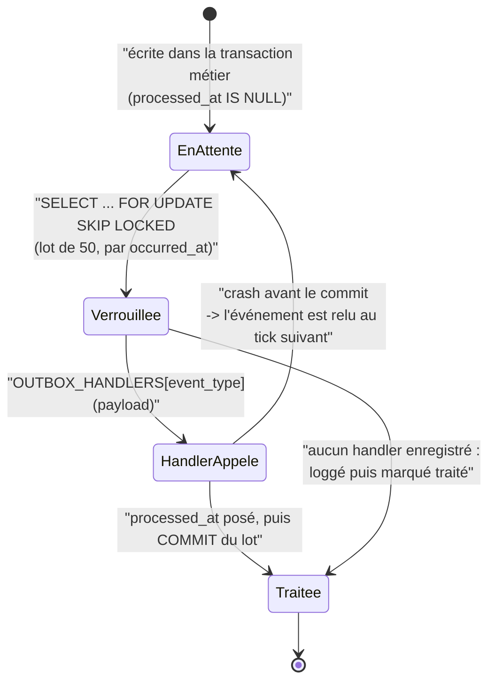

# Événements de domaine et pattern Outbox

## Le dilemme que l'outbox supprime

Un use case qui écrit en base **puis** publie un message manipule deux systèmes qu'aucune
transaction ne peut engager ensemble. Deux pannes symétriques guettent :

- **publier avant le commit**, et voir le commit échouer : on a annoncé un fait qui n'a
  jamais eu lieu — un email de bienvenue pour une clinique jamais créée ;
- **publier après le commit**, et voir le processus mourir entre les deux : l'événement
  est perdu à jamais — clinique créée, aucun email.

La transaction distribuée résoudrait le problème, au prix d'une complexité que ce projet
refuse. Le pattern Outbox le résout autrement : **on n'écrit que dans PostgreSQL**.

## La moitié « écriture » : le commit

Un use case n'exécute jamais l'effet de bord. Il émet un événement de domaine — un fait
**accompli**, nommé au passé — et le UoW s'occupe du reste :

```python
async def commit(self) -> None:
    for event in self._events:
        self.session.add(
            OutboxEventModel(
                id=event.event_id,
                event_type=event.event_type,
                payload=event.payload(),
                occurred_at=event.occurred_at,
            )
        )
    self._events.clear()
    await self.session.commit()
```

Les lignes métier et les lignes d'événement partent dans **la même transaction**. Soit
tout est commité, soit rien.

Symétriquement, `rollback()` **vide le tampon d'événements** : un changement abandonné ne
doit jamais publier quoi que ce soit, et un commit ultérieur du même UoW ne doit pas
rejouer des événements devenus faux.

Un `DomainEvent` est `frozen=True` — un fait passé est immuable — et son `occurred_at`
n'a **pas de valeur par défaut** : l'heure vient du port `Clock` injecté, jamais d'un
`datetime.now()` caché.

## La table

`outbox_events` porte cinq colonnes : `id` (celui de l'événement, donc une clé
d'idempotence naturelle), `event_type`, `payload` en `JSONB`, `occurred_at`, et
`processed_at` — `NULL` tant que l'événement attend.

Deux détails qui comptent :

- **`JSONB`, pas `JSON` texte** : validé, compact, indexable si le besoin apparaît. Le
  contenu doit rester sérialisable, d'où la conversion des `UUID` et des `datetime` en
  chaînes dans `payload()`.
- **un index partiel**, qui n'indexe que les lignes en attente :

  ```sql
  CREATE INDEX ix_outbox_events_unprocessed ON outbox_events (occurred_at)
    WHERE processed_at IS NULL;
  ```

  C'est la seule partie que le relais interroge en boucle. La table peut grossir
  indéfiniment sans ralentir le scrutin, et l'index reste minuscule.

On **marque** au lieu de supprimer, conformément à la règle « jamais de `DELETE` » du
projet — ce qui laisse au passage une trace auditable, purgeable plus tard.

## La moitié « lecture » : le relais



Le relais est lui-même une tâche TaskIQ, planifiée **toutes les minutes** par le
scheduler :

```python
@broker.task(task_name="outbox.relay", schedule=[{"cron": "* * * * *"}])
async def relay_outbox(request: Annotated[Request, TaskiqDepends()]) -> int:
    ...
```

C'est du **scrutin** : simple et robuste, au prix d'une latence moyenne d'environ trente
secondes. Un `TODO` du fichier note la piste `LISTEN/NOTIFY` pour la réduire.

### `FOR UPDATE SKIP LOCKED`

Chaque instance de relais **saute** les lignes déjà verrouillées par une autre au lieu
d'attendre. Deux workers se partagent donc la file sans blocage ni double traitement
simultané, sans coordination externe.

### `BATCH_SIZE = 50`

Borne le travail d'un tick, et surtout la durée pendant laquelle les lignes restent
verrouillées.

### L'événement sans handler

Un `event_type` inconnu — module de tâches non importé par le worker, faute de frappe —
est **loggé puis marqué traité**. Sans cela, il serait retenté à chaque tick, pour
toujours.

## At-least-once, donc idempotence obligatoire

Le handler est appelé **pendant** la transaction, mais `processed_at` ne devient durable
qu'au commit final. Si le processus meurt entre les deux, l'événement sera relu et le
handler rappelé.

C'est un compromis assumé : **on préfère un doublon possible à une perte certaine**. La
contrepartie est une exigence non négociable — tout handler doit être **idempotent**.
L'`event_id`, qui est aussi la clé primaire de la ligne, sert de clé de déduplication
naturelle.

## Le registre, et l'inversion de dépendance

Le relais lit des lignes génériques : il lui faut savoir quoi faire de chaque type. Le
mapping est un simple dictionnaire de module :

```python
OUTBOX_HANDLERS: dict[str, OutboxHandler] = {}


def register_outbox_handler(event_type: str, handler: OutboxHandler) -> None:
    OUTBOX_HANDLERS[event_type] = handler
```

Pourquoi cette indirection plutôt qu'un `import` direct ? Parce que `shared` ne doit
connaître **aucun** contexte métier. L'inversion de dépendance est ici littérale :
`shared` expose le point d'accroche, et chaque contexte vient s'y brancher au niveau
module de son fichier `infrastructure/tasks.py`. Le simple import du module par
`vetolib.worker` suffit à peupler le registre — aucun framework de plugins, juste un
effet d'import maîtrisé.

Conséquence pratique à connaître : **si un module de tâches n'est pas importé par le
worker, ses événements resteront sans handler**, et le relais les marquera traités après
un avertissement.

En général, un handler se contente d'un `.kiq(...)` : il pousse la vraie charge de
travail dans une tâche TaskIQ dédiée, ce qui garde le relais rapide.

## Ce qui reste à faire

Les `TODO` du fichier `relay.py` sont explicites : `LISTEN/NOTIFY` pour réduire la
latence, un backoff et une file de rebut (_dead letter_) pour les handlers qui échouent
en boucle, et une purge périodique des événements traités.

Voir [ADR-0004](../adr/0004-pattern-outbox.md).
