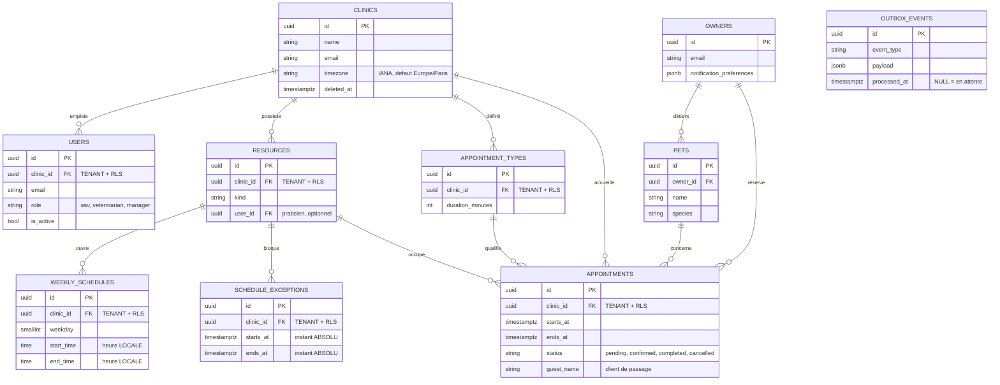

# Modèle de données et conventions SQL

## La carte des tables



Les tables annotées **TENANT + RLS** portent `clinic_id` et sont protégées par la
politique `tenant_isolation`. `owners`, `pets` et `outbox_events` ne le sont pas, pour
les raisons expliquées dans
[Isolation multi-tenant et RLS](multi-tenant-et-rls.md#ce-qui-est-tenanté-et-ce-qui-ne-lest-pas).
`outbox_events` est volontairement isolée du graphe : elle n'a de relation avec rien.

## Les conventions transverses

Elles sont encodées une seule fois, dans `shared/infrastructure/db/base.py`, sous forme
de mixins que chaque modèle compose.

### 1. Clé primaire UUID, générée par le domaine

```python
class UUIDPrimaryKeyMixin:
    id: Mapped[uuid.UUID] = mapped_column(primary_key=True)
```

Aucun `default` : l'identifiant est produit par la couche domaine à la création de
l'entité, pas par la base. On connaît donc l'`id` **avant** l'`INSERT`, ce qui simplifie
les événements de domaine, les réponses d'API et les liens entre agrégats.

Un entier auto-incrémenté aurait un autre défaut, décisif ici : les identifiants
circulent dans des URL publiques, et une séquence est énumérable.

### 2. Horodatage de création

`created_at` est fourni par le domaine via le port `Clock`. Le `server_default=func.now()`
n'est **qu'un filet de sécurité** pour un `INSERT` fait hors ORM. `timezone=True` donne
une colonne `timestamptz`, stockée en UTC.

### 3. Soft delete généralisé

```python
class SoftDeleteMixin:
    deleted_at: Mapped[datetime | None] = mapped_column(DateTime(timezone=True))
```

`NULL` signifie « ligne vivante ». Le corollaire est une **obligation** : toute lecture
doit filtrer `deleted_at IS NULL`, et c'est le rôle des repositories d'y veiller.

La règle n'est pas seulement une convention : les `GRANT` accordés à `vetolib_app`
**n'incluent pas `DELETE`**. Un `DELETE` accidentel échoue au niveau de la base.

### 4. Index uniques partiels

Un `UNIQUE` classique sur `email` interdirait de réutiliser l'adresse d'un compte
supprimé — ce qui, avec un soft delete, condamnerait l'adresse à jamais. La contrainte
est donc **restreinte aux lignes vivantes** :

```python
Index(
    "uq_users_email_active",
    "clinic_id",
    "email",
    unique=True,
    postgresql_where=sa.text("deleted_at IS NULL"),
)
```

Le même mécanisme sert l'index de l'outbox, restreint à `processed_at IS NULL`.

### 5. Nommage déterministe des contraintes

```python
NAMING_CONVENTION = {
    "ix": "ix_%(column_0_label)s",
    "uq": "uq_%(table_name)s_%(column_0_name)s",
    "ck": "ck_%(table_name)s_%(constraint_name)s",
    "fk": "fk_%(table_name)s_%(column_0_name)s_%(referred_table_name)s",
    "pk": "pk_%(table_name)s",
}
```

Sans convention, PostgreSQL génère des noms arbitraires et une migration Alembic ne peut
plus retrouver une contrainte pour la modifier : le nom différerait d'un environnement à
l'autre.

La migration `0005` existe précisément parce que cette convention avait été
court-circuitée : les migrations `0001` à `0004` passaient à `CheckConstraint` des noms
**déjà préfixés**, que la convention préfixait une seconde fois — d'où des
`ck_users_ck_users_role_valid` en base, invisibles jusqu'au jour où un `autogenerate`
aurait dérivé. Voir [Migrations Alembic](../backend/migrations-alembic.md).

### 6. JSONB pour l'extensible

`owners.notification_preferences` est un `JSONB`. Un ensemble de préférences est
typiquement ce qui s'enrichit sans arrêt : lui donner une colonne par option
transformerait chaque ajout en migration.

## L'anti-double-réservation, arbitré par PostgreSQL

Deux propriétaires cliquent au même instant sur le même créneau. Un contrôle applicatif
« je lis, je vérifie, j'écris » perd cette course : les deux transactions lisent avant que
l'une n'écrive.

La contrainte est donc posée dans la base :

```sql
ALTER TABLE appointments ADD CONSTRAINT ex_appointments_no_overlap
EXCLUDE USING gist (
    resource_id WITH =,
    tstzrange(starts_at, ends_at) WITH &&
)
WHERE (status IN ('pending', 'confirmed'));
```

Trois choses à y lire.

**`EXCLUDE USING gist`** mélange une égalité (`resource_id`) et un chevauchement
d'intervalles (`&&`). C'est ce qui impose l'extension `btree_gist`, créée à la main dans
la migration `0004` : sans elle, un index GiST ne sait pas indexer un UUID.

**`tstzrange(starts_at, ends_at)`** utilise des bornes **demi-ouvertes** `[début, fin)`.
Deux rendez-vous adjacents — 10 h 00-10 h 30 puis 10 h 30-11 h 00 — ne se chevauchent
donc pas.

**Le `WHERE`** limite l'arbitrage aux statuts actifs. C'est l'effet le plus élégant du
montage : **annuler un rendez-vous le fait sortir du périmètre de la contrainte, donc
libère automatiquement le créneau**, sans une ligne de code supplémentaire. Voir
[Cycle de vie d'un rendez-vous](../metier/cycle-de-vie-d-un-rendez-vous.md).

## Ce qu'Alembic n'autogénère pas

Trois familles d'objets doivent être écrites à la main avec `op.execute` :

1. les **extensions** (`btree_gist`) ;
2. les **politiques RLS** et les `ENABLE ROW LEVEL SECURITY` ;
3. les **`GRANT`** au rôle applicatif.

C'est la raison pour laquelle la migration `0001` est explicitement décrite comme un
gabarit : chaque nouvelle table tenantée doit reproduire ces trois blocs.

Voir [ADR-0005](../adr/0005-uuid-soft-delete-index-partiels.md) et
[ADR-0006](../adr/0006-anti-double-reservation-en-base.md).
