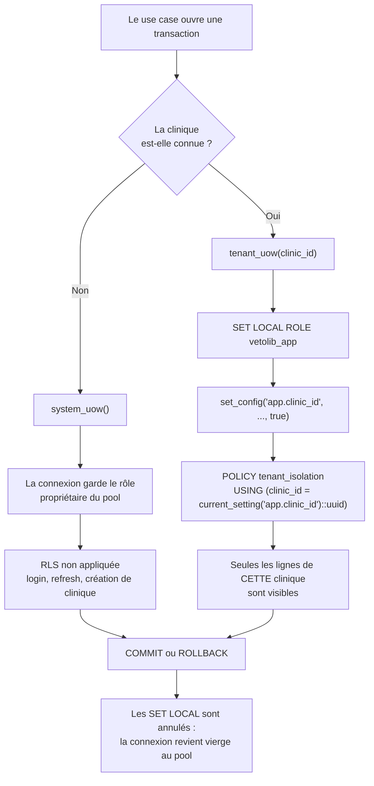

# Isolation multi-tenant et Row-Level Security

## Le modèle retenu

VetoLib héberge toutes les cliniques dans **une base de données unique**, avec des
tables partagées portant une colonne `clinic_id`. C'est le modèle le plus économe :
une seule migration à appliquer, un seul pool de connexions, une seule sauvegarde.

C'est aussi le plus dangereux. Dans ce modèle, **un `WHERE clinic_id = ...` oublié dans
une requête devient une fuite de données de santé**. Sur des dizaines de requêtes écrites
par des personnes différentes sur plusieurs années, la probabilité qu'un oubli survienne
n'est pas faible : elle est proche de 1.

VetoLib déplace donc la défense hors du code applicatif, dans la base elle-même, avec la
**Row-Level Security** de PostgreSQL.

## Pourquoi un rôle dédié `vetolib_app`

La RLS a une propriété que l'on découvre souvent trop tard : **elle ne s'applique pas à
tout le monde**. PostgreSQL l'ignore pour :

- les **superusers** ;
- les rôles marqués `BYPASSRLS` ;
- **le propriétaire des tables**, sauf `FORCE ROW LEVEL SECURITY`.

Une application connectée avec le rôle qui a créé les tables voit donc _toutes_ les
lignes, politiques ou pas. C'est pourquoi le projet crée un rôle applicatif distinct, au
moment de l'initialisation de PostgreSQL
(`docker/postgres-init/02-app-role.sh`) :

```sql
CREATE ROLE vetolib_app NOLOGIN NOBYPASSRLS;
```

`NOBYPASSRLS` est explicite pour la même raison qu'un commentaire l'est : c'est déjà le
défaut, mais l'écrire rend l'intention impossible à supprimer par accident.

Les `GRANT` accordés à ce rôle sont volontairement **sans `DELETE`** : le projet ne
supprime jamais physiquement une ligne, il pose `deleted_at`. Voir
[Modèle de données](modele-de-donnees.md).

## Deux modes de transaction

Toutes les transactions passent par un _Unit of Work_, qui existe en deux variantes.



### `system_uow()` — avant de connaître le tenant

Certains flux ne _peuvent pas_ connaître la clinique : au moment où quelqu'un se
connecte, on ne sait pas encore qui il est. La connexion garde alors le rôle
propriétaire du pool et la RLS ne s'applique pas.

Ce mode est réservé aux flux pré-tenant par nature : connexion, rafraîchissement de
jeton, enregistrement d'une nouvelle clinique. Il sert aussi aux tables non tenantées
(`owners`, `pets`), dont le filtrage est applicatif.

### `tenant_uow(clinic_id)` — le mode normal

Dès que la clinique est connue — elle vient du claim `cid` du jeton d'accès —, la
transaction bascule :

```python
await self._session.execute(text(f'SET LOCAL ROLE "{self._app_db_role}"'))
await self._session.execute(
    text("SELECT set_config('app.clinic_id', :clinic_id, true)"),
    {"clinic_id": str(self._tenant.clinic_id)},
)
```

Trois détails comptent dans ces quatre lignes.

**`SET LOCAL`, et non `SET`.** La bascule ne vaut que pour la transaction en cours. Au
`COMMIT` ou au `ROLLBACK`, la connexion revient « vierge » au pool. Sans cela, la requête
HTTP suivante qui réutiliserait la même connexion hériterait du rôle et du `clinic_id`
de la précédente — une fuite silencieuse entre deux clientes. C'est aussi ce qui rend le
montage compatible avec PgBouncer en mode transaction.

**`set_config(..., true)` plutôt que `SET LOCAL app.clinic_id = ...`.** Les deux formes
sont équivalentes, mais seule `set_config` accepte un **paramètre lié**. Le `clinic_id`
venant d'un jeton, il ne doit jamais être concaténé dans du SQL. Le troisième argument
`true` est ce qui donne la portée « transaction ».

**Le nom du rôle vient de la configuration, pas d'une entrée utilisateur.** Un
identifiant SQL ne peut pas être paramétré : il est donc interpolé, et c'est acceptable
uniquement parce que `app_db_role` est une variable d'environnement validée au
démarrage, jamais une donnée de requête.

## La politique, côté base

Les politiques ne sont pas générées par Alembic : elles sont écrites à la main dans les
migrations, sur le gabarit posé par `0001_identity_initial.py` :

```sql
ALTER TABLE users ENABLE ROW LEVEL SECURITY;

CREATE POLICY tenant_isolation ON users
FOR ALL
USING      (clinic_id = NULLIF(current_setting('app.clinic_id', true), '')::uuid)
WITH CHECK (clinic_id = NULLIF(current_setting('app.clinic_id', true), '')::uuid);
```

À partir de là, `SELECT * FROM users` exécuté sous le rôle `vetolib_app` **ne peut
retourner** que les lignes de la clinique courante. Le `WHERE` oublié n'est plus une
faille : c'est au pire un résultat trop large à l'intérieur d'un même tenant.

Trois précisions sur cette politique, toutes délibérées :

- **`FOR ALL` et non `FOR SELECT`.** La politique couvre aussi les écritures : sans
  `WITH CHECK`, une transaction tenant pourrait _insérer_ une ligne portant le
  `clinic_id` d'une autre clinique.
- **`current_setting('app.clinic_id', true)`** — le second argument évite l'erreur si la
  variable n'a jamais été posée ; la fonction renvoie alors `NULL`.
- **`NULLIF(..., '')`** — sur une connexion poolée dont un `SET LOCAL` a été réinitialisé,
  `current_setting` ne renvoie pas `NULL` mais la **chaîne vide**. Sans ce `NULLIF`, le
  cast en `uuid` échouerait. Avec lui, la comparaison porte sur `NULL`, donc aucune ligne
  ne remonte : le comportement par défaut est _fail-closed_, ce qui est la seule valeur
  acceptable pour une barrière de sécurité.

:::note Pas de `FORCE ROW LEVEL SECURITY`
Le rôle propriétaire des tables — celui des migrations Alembic et de la UoW système —
continue donc de contourner ces politiques. C'est voulu : c'est exactement ce qui permet
aux flux pré-tenant de fonctionner, et c'est pourquoi tout le reste passe par
`vetolib_app`.
:::

## Ce qui est tenanté, et ce qui ne l'est pas

| Table                                                                                       | `clinic_id` | RLS | Pourquoi                                                                     |
| ------------------------------------------------------------------------------------------- | ----------- | --- | ---------------------------------------------------------------------------- |
| `clinics`                                                                                   | —           | —   | C'est la table des tenants eux-mêmes                                         |
| `users`                                                                                     | oui         | oui | Un membre du personnel appartient à une clinique                             |
| `owners`                                                                                    | non         | non | Un propriétaire est un compte **global** : il consultera plusieurs cliniques |
| `pets`                                                                                      | non         | non | Un animal appartient à son propriétaire, pas à une clinique                  |
| `resources`, `weekly_schedules`, `schedule_exceptions`, `appointment_types`, `appointments` | oui         | oui | Tout l'agenda est propre à une clinique                                      |
| `outbox_events`                                                                             | non         | non | Table technique, lue par le relais hors de tout contexte tenant              |

Les deux lignes qui surprennent — `owners` et `pets` — sont documentées dans les
docstrings des migrations `0002` et `0003`. Le raisonnement tient en une phrase : il
n'existe **aucun `clinic_id`** sur lequel une politique pourrait filtrer, puisque ces
entités traversent les cliniques. Le lien animal ↔ clinique se matérialise dans les
tables tenantées des autres contextes, chacune protégée par sa propre politique.

`outbox_events` est un cas différent : une politique RLS y **masquerait des événements**
au relais, qui travaille pour toutes les cliniques à la fois.

## Comment on vérifie que la décision tient

Le fichier `backend/tests/integration/test_rls_isolation.py` monte deux cliniques dans
un PostgreSQL réel (via testcontainers) et vérifie qu'une transaction ouverte pour l'une
ne voit rien de l'autre — y compris en émettant volontairement une requête **sans**
clause de filtrage.

C'est précisément pour ce genre de test que le projet refuse SQLite : ni la RLS, ni
`SET LOCAL`, ni les index partiels ne sont émulables. Voir
[Stratégie de tests](../backend/strategie-de-tests.md) et
[ADR-0008](../adr/0008-testcontainers-plutot-que-sqlite.md).

Voir aussi [ADR-0002](../adr/0002-multi-tenant-par-rls.md).
