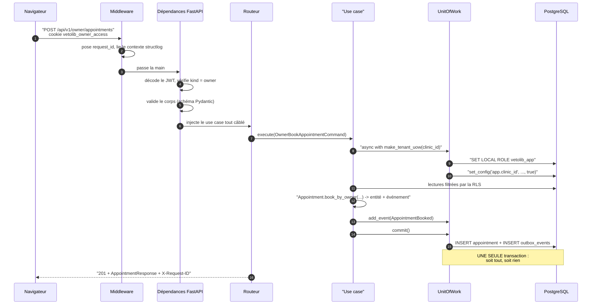

# Une requête HTTP, de bout en bout

Cette page suit **un seul appel** — la réservation d'un rendez-vous par un propriétaire,
`POST /api/v1/owner/appointments` — depuis le clic dans le navigateur jusqu'à la réponse.
C'est le meilleur moyen de voir les quatre couches travailler ensemble.

## Le trajet



## Étape par étape

### 1. Le middleware pose le fil conducteur

`shared/presentation/middleware.py` s'exécute avant et après chaque requête. Il génère un
`request_id`, le range dans le contexte structlog, et le renvoie dans l'en-tête
`X-Request-ID`. Toutes les lignes de log produites pendant la requête le portent : quand
un utilisateur signale une erreur, cet identifiant suffit à retrouver le trajet complet.

### 2. Les dépendances résolvent l'identité

`CurrentOwnerDep` lit le cookie `vetolib_owner_access`, décode le JWT, vérifie signature,
expiration, audience, émetteur, `type == "access"` et `kind == "owner"`. En cas d'échec,
`InvalidTokenError` remonte, et le gestionnaire d'erreurs répond `401`.

Point de sécurité important, visible dans le routeur :

```python
dto = await use_case.execute(
    OwnerBookAppointmentCommand(
        owner_id=current.id,   # <- vient de la SESSION
        clinic_id=body.clinic_id,
        ...
    )
)
```

`owner_id` vient **toujours** de la session, jamais du corps de la requête. Sans cette
règle, n'importe qui pourrait réserver au nom d'autrui en changeant un identifiant dans
le JSON.

### 3. Pydantic valide le corps

Le schéma `OwnerBookAppointmentRequest` rejette un corps mal formé avant que la moindre
ligne de logique ne s'exécute. Un échec produit un `422` généré par FastAPI.

### 4. Le use case reçoit ses ports déjà branchés

Le routeur ne construit rien : il reçoit le use case par injection. Le câblage vit dans
`scheduling/presentation/dependencies.py`, le _composition root_ du contexte. C'est
également là que se décide **quel mode d'UoW** utiliser :

| Fabrique                            | Usage                                                                                                              |
| ----------------------------------- | ------------------------------------------------------------------------------------------------------------------ |
| `get_scheduling_tenant_uow_factory` | UoW tenant figée sur le `cid` du jeton **personnel**                                                               |
| `get_scheduling_make_tenant_uow`    | UoW tenant **paramétrée**, pour la réservation d'un propriétaire — la clinique vient de sa demande, pas d'un jeton |
| `get_scheduling_system_uow_factory` | UoW système pour les lectures publiques et les vues propriétaire multi-cliniques                                   |

### 5. Le UoW bascule la transaction en mode tenant

Les deux `SET LOCAL` décrits dans
[Isolation multi-tenant et RLS](multi-tenant-et-rls.md) sont émis à l'ouverture du bloc
`async with`. À partir de cet instant, **toute** requête de la transaction est filtrée par
PostgreSQL.

### 6. Le domaine décide

C'est la seule étape qui contient du métier, et elle est entièrement testable sans base :

```python
appointment, event = Appointment.book_by_owner(
    clinic_id=...,
    resource_id=...,
    starts_at=...,
    ends_at=...,
    now=self._clock.now(),
)
```

La méthode renvoie **un couple** : l'entité, et l'événement de domaine qui décrit le fait
accompli. Le domaine ne publie rien lui-même ; il se contente de dire ce qui vient de se
passer.

### 7. Le commit est atomique

```python
async def commit(self) -> None:
    for event in self._events:
        self.session.add(OutboxEventModel(...))
    self._events.clear()
    await self.session.commit()
```

Le rendez-vous **et** la ligne d'outbox partent dans la même transaction. Il est donc
impossible d'avoir un rendez-vous sans son événement, ou un événement annonçant un
rendez-vous inexistant. Voir
[Événements de domaine et pattern Outbox](evenements-et-outbox.md).

:::tip Le filet de sécurité
Sortir du bloc `async with` **sans** appeler `commit()` ne persiste rien : `close()`
annule la transaction restée ouverte. Oublier le commit produit une absence d'effet, pas
un état partiel.
:::

### 8. Les erreurs deviennent des statuts HTTP

Le domaine lève des exceptions métier sans rien connaître de HTTP. La traduction se fait
en un seul endroit, `shared/presentation/error_handlers.py`, avec une résolution par MRO
— l'entrée la plus précise gagne :

| Erreur de domaine       | Statut                              |
| ----------------------- | ----------------------------------- |
| `DomainValidationError` | `422`                               |
| `EntityNotFoundError`   | `404`                               |
| `ConflictError`         | `409`                               |
| `PermissionDeniedError` | `403`                               |
| non déclarée            | `500` + log `unmapped_domain_error` |

Le corps est toujours de la même forme :

```json
{
  "code": "appointment_slot_taken",
  "detail": "Ce créneau vient d'être réservé."
}
```

`code` est un identifiant **stable**, sur lequel un frontend peut brancher un `switch` ;
`detail` est le message destiné à un humain. Chaque contexte enrichit la table par un
dictionnaire `<CONTEXTE>_ERROR_STATUS`, fusionné dans `main.py`.

Une erreur non déclarée donne un `500` **volontairement** : c'est un oubli de
configuration, pas une faute du client, et le log le signale pour qu'on corrige le
mapping.

### 9. La réponse

Le routeur convertit le DTO en schéma Pydantic, FastAPI sérialise, et le middleware
ajoute `X-Request-ID` au passage retour.

## Ce que ce trajet illustre

- La logique métier **n'apparaît qu'à l'étape 6**. Tout le reste est de la plomberie
  identique pour chaque endpoint.
- Les seuls endroits qui connaissent HTTP sont le middleware, les dépendances, le routeur
  et les gestionnaires d'erreurs — tous dans `presentation/`.
- L'isolation multi-tenant n'est pas dans le use case : elle est dans le UoW, donc
  impossible à oublier requête par requête.
