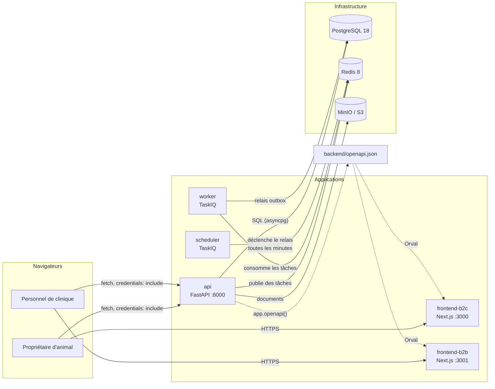

# Vue d'ensemble du monorepo

VetoLib est un **SaaS B2B2C** : un même backend sert deux publics qui ne se
ressemblent pas. Les cliniques vétérinaires gèrent leur agenda, leurs praticiens et
leurs rendez-vous ; les propriétaires d'animaux réservent en ligne et suivent le carnet
de santé de leurs bêtes. Cette double audience explique la quasi-totalité des choix
d'architecture décrits dans cette section : deux frontends distincts, deux espaces
d'authentification cloisonnés, et une base de données partagée mais compartimentée.

## Les cinq briques

Tout vit dans un seul dépôt Git. Les dossiers de premier niveau sont les briques :

| Dossier          | Rôle                                             | Techno                                |
| ---------------- | ------------------------------------------------ | ------------------------------------- |
| `backend/`       | L'API et les traitements asynchrones             | FastAPI, SQLAlchemy 2.0 async, TaskIQ |
| `frontend-b2c/`  | Le portail des propriétaires d'animaux (`:3000`) | Next.js App Router                    |
| `frontend-b2b/`  | Le portail des cliniques (`:3001`)               | Next.js App Router                    |
| `docker/`        | Images et scripts d'initialisation               | Dockerfiles, SQL, shell               |
| `documentation/` | Ce site                                          | Docusaurus                            |

Le `Makefile` racine est le point d'entrée unique de toutes les commandes ; il délègue
au `Makefile` du backend et pilote les projets npm. Voir
[Le Makefile](../demarrer/commandes-make.md).

## Qui parle à qui



Le point le plus important de ce schéma est ce qu'il **ne** montre pas : il n'y a
**aucune flèche entre un frontend et l'API côté serveur**. Les deux portails Next.js
sont servis au navigateur, et c'est le navigateur — donc le poste de l'utilisateur —
qui appelle l'API. C'est ce qui rend possible l'authentification par cookies HttpOnly
décrite dans [Authentification](authentification.md) : le cookie appartient au
navigateur, pas au serveur Next.js.

Les flèches en pointillés décrivent une chaîne de génération, pas un appel à
l'exécution : FastAPI produit un contrat OpenAPI, Orval en dérive les hooks TypeScript
des deux frontends. Voir [Le client API généré par Orval](../frontends/client-api-orval.md).

## Ce qui tourne dans Docker, et ce qui n'y tourne pas

En développement, `make up` démarre **l'infrastructure, l'API, le worker et le
scheduler** dans Docker. Les deux frontends, eux, tournent **hors Docker**
(`make dev-b2c`, `make dev-b2b`) : le rechargement à chaud de Next.js est nettement
plus rapide en natif que dans un conteneur avec un volume monté.

Une pile entièrement conteneurisée reste disponible pour la démonstration, via le
profil Docker Compose `frontend` :

```bash
docker compose --profile frontend up -d
```

Détail des services dans [La pile Docker](../exploitation/stack-docker.md).

## Pourquoi un monorepo sans espace de travail npm

Les deux frontends — et ce site de documentation — sont trois projets npm
**indépendants**, chacun avec son propre `package-lock.json`. Il n'y a ni `package.json`
racine, ni `workspaces`.

Ce choix a un coût assumé : `tsconfig.json`, `eslint.config.mjs` et `vitest.setup.ts`
sont dupliqués à l'identique entre les deux portails. En échange :

- **chaque application se construit seule.** L'image Docker d'un frontend ne copie que
  son dossier ; un espace de travail obligerait à hisser tout l'arbre de dépendances
  dans le contexte de build ;
- **Dependabot voit trois écosystèmes séparés** et ouvre des demandes de fusion ciblées
  au lieu d'un unique lot mélangeant les trois ;
- **une mise à jour cassante ne fige qu'une application.** Avec un `node_modules`
  hissé, une contrainte de version d'un projet devient la contrainte de tous.

Le partage se fait donc par duplication assumée et par le `Makefile`, pas par l'outillage
npm.

## Où aller ensuite

- [Architecture hexagonale et DDD](architecture-hexagonale.md) — les quatre couches et
  le sens des dépendances.
- [Les quatre bounded contexts](bounded-contexts.md) — le découpage métier.
- [Une requête HTTP, de bout en bout](requete-de-bout-en-bout.md) — le trajet complet
  d'un appel, du cookie au commit.
