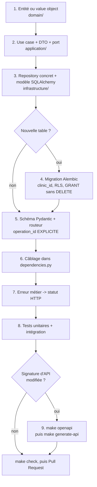

# Ajouter un endpoint, de A à Z

Cette page est la recette à suivre, dans l'ordre. Le contexte `patients/` est le plus
petit du projet : il se lit intégralement en quelques minutes et sert de modèle.

## La checklist



## 1. Le domaine

Commencez par la règle métier, pas par la route. Si le comportement tient dans une
méthode d'entité, c'est là qu'il va — avec sa garde :

```python
def confirm(self, now: datetime) -> AppointmentConfirmed:
    if self.status is not AppointmentStatus.PENDING:
        raise InvalidAppointmentTransitionError(...)
    self.status = AppointmentStatus.CONFIRMED
    return AppointmentConfirmed(...)
```

Une nouvelle notion auto-validée devient un **value object** (`frozen=True`, validation
dans `__post_init__`).

## 2. Le use case

Une classe, une méthode `execute`, des dépendances reçues au constructeur — jamais
construites à l'intérieur :

```python
class ConfirmAppointment:
    def __init__(self, uow_factory: SchedulingTenantUoWFactory, clock: Clock) -> None:
        self._uow_factory = uow_factory
        self._clock = clock

    async def execute(self, appointment_id: uuid.UUID) -> AppointmentDTO:
        async with self._uow_factory() as uow:
            appointment = await uow.appointments.get(appointment_id)
            event = appointment.confirm(self._clock.now())
            await uow.appointments.save(appointment)
            uow.add_event(event)
            await uow.commit()
            return to_dto(appointment)
```

Trois points de vigilance :

- **l'heure vient du `Clock`**, jamais de `datetime.now()` ;
- **`uow.add_event()` avant `commit()`** — l'événement part dans la même transaction ;
- **les DTO sont `frozen=True`**, comme partout dans `application/`.

Si le use case a besoin d'une capacité nouvelle (envoyer un SMS, appeler une API), on
déclare un **port** dans `application/ports.py` et on l'implémente en `infrastructure/` —
jamais l'inverse.

## 3. Le repository et le modèle

Le port vit dans `domain/repositories.py`, l'implémentation dans
`infrastructure/repositories.py`. Le modèle SQLAlchemy compose les mixins :

```python
class AppointmentModel(
    Base, UUIDPrimaryKeyMixin, TimestampMixin, SoftDeleteMixin, TenantMixin
):
    __tablename__ = "appointments"
```

`TenantMixin` apporte la colonne `clinic_id`. **Ne l'omettez que si vous savez pourquoi**
— les seules tables sans tenant sont `owners`, `pets` et `outbox_events`, chacune pour
une raison documentée.

Toute lecture doit filtrer `deleted_at IS NULL`. C'est la responsabilité du repository.

## 4. La migration, si le schéma change

```bash
make revision m="scheduling: ajoute la colonne X"
```

Pour une **nouvelle table tenantée**, trois blocs ne sont **pas** autogénérés par Alembic
et doivent être écrits à la main :

```python
op.execute(f"GRANT SELECT, INSERT, UPDATE ON ma_table TO {APP_ROLE}")  # jamais DELETE
op.execute("ALTER TABLE ma_table ENABLE ROW LEVEL SECURITY")
op.execute(
    """
    CREATE POLICY tenant_isolation ON ma_table
    FOR ALL
    USING      (clinic_id = NULLIF(current_setting('app.clinic_id', true), '')::uuid)
    WITH CHECK (clinic_id = NULLIF(current_setting('app.clinic_id', true), '')::uuid)
    """
)
```

Voir [Migrations de base de données](migrations-alembic.md) pour le détail, y compris la
réversibilité.

## 5. Le schéma et la route

```python
@router.post(
    "/{appointment_id}/confirm",
    operation_id="confirmAppointment",
)
async def confirm_appointment(
    appointment_id: uuid.UUID,
    current: CurrentUserDep,
    use_case: Annotated[ConfirmAppointment, Depends(get_confirm_appointment)],
) -> AppointmentResponse:
    """Confirme une demande de rendez-vous (action de la clinique)."""
    return AppointmentResponse.from_dto(await use_case.execute(appointment_id))
```

:::danger `operation_id` est obligatoire, et c'est un contrat
Le nom du hook TypeScript en découle directement : `confirmAppointment` produit
`useConfirmAppointment`. Sans `operation_id` explicite, FastAPI en fabrique un à partir
du nom de fonction et du chemin, illisible et instable. **Le renommer est un changement
cassant** pour les deux portails.
:::

Règle de sécurité systématique : **l'identité vient de la session, jamais du corps**.

```python
owner_id=current.id,          # ✅ vient du cookie
owner_id=body.owner_id,       # ❌ n'importe qui pourrait agir au nom d'autrui
```

## 6. Le câblage

Dans `presentation/dependencies.py`, on décide quelle implémentation brancher **et quel
mode d'UoW** utiliser :

| Fabrique                 | Quand                                                                                         |
| ------------------------ | --------------------------------------------------------------------------------------------- |
| `..._tenant_uow_factory` | La clinique vient du claim `cid` du jeton personnel                                           |
| `..._make_tenant_uow`    | La clinique vient de la demande (réservation par un propriétaire)                             |
| `..._system_uow_factory` | Flux pré-tenant ou table non tenantée — le filtre explicite du repository **est** la barrière |

## 7. L'erreur → le statut

Une nouvelle erreur métier s'ajoute au dictionnaire du contexte, dans
`presentation/router.py` :

```python
SCHEDULING_ERROR_STATUS = {
    InvalidAppointmentTransitionError: status.HTTP_409_CONFLICT,
    CancellationTooLateError: status.HTTP_409_CONFLICT,
}
```

Une erreur oubliée n'échoue pas silencieusement : elle produit un `500` et un log
`unmapped_domain_error`.

## 8. Les tests

| Niveau               | Ce qu'on y met                                                                       |
| -------------------- | ------------------------------------------------------------------------------------ |
| `tests/unit/`        | La règle métier, avec des doublures en mémoire. Sans Docker                          |
| `tests/integration/` | Le trajet HTTP complet sur un vrai PostgreSQL — et **toute** interaction avec la RLS |

Voir [Stratégie de tests](strategie-de-tests.md).

## 9. Régénérer le client

Dès que la signature d'un endpoint change — chemin, paramètres, schéma de réponse,
`operation_id` :

```bash
make up                # l'API doit tourner sur :8000
make generate-api      # régénère les TROIS applications Next
```

**Un oubli bloque la demande de fusion** : le job `api-client-drift` régénère le client
en CI et échoue si `git status` n'est pas vide. Voir
[Le client API généré par Orval](../frontends/client-api-orval.md).

## Pagination des listes

Tout endpoint qui renvoie une liste **non bornée par nature** est paginé. Le contrat est
le même partout, et il n'y en a qu'un :

| Élément               | Convention                                                                |
| --------------------- | ------------------------------------------------------------------------- |
| Paramètres de requête | `limit` (1 à 100, défaut 20), `offset` (≥ 0), `search`, plus les filtres  |
| Tri                   | `sort_by` (un `StrEnum` **liste blanche**) et `sort_dir` (`asc` / `desc`) |
| Réponse               | `{ items, total, limit, offset }`                                         |
| Type de retour        | une sous-classe **nommée** de `PageResponse[T]`, jamais le générique brut |

Les alias `LimitQuery`, `OffsetQuery` et `SearchQuery` de
`shared/presentation/pagination.py` portent les bornes : hors bornes, FastAPI répond
`422` avant même d'appeler le use case.

Trois points de conception à ne pas rediscuter sans raison :

- **`limit`/`offset` et pas `page`/`page_size`.** C'est déjà la convention de
  `GET /public/clinics` ; deux conventions dans le même contrat OpenAPI seraient une
  verrue dans la documentation et dans les trois clients générés. `limit`/`offset` se
  traduit aussi tel quel en SQL, là où `page`/`page_size` impose une conversion qui est
  le terrain de jeu classique des erreurs de décalage de un.
- **Pas de `total_pages`.** C'est une donnée dérivée de `total` et `limit` ; on ne
  transporte jamais une donnée dérivée, elle finit par contredire celle dont elle dérive.
- **Une sous-classe nommée par ressource.** FastAPI nomme un générique paramétré
  `PageResponse_AdminClinicSummary_` : illisible dans la page de référence de l'API comme
  dans les types TypeScript. Trois lignes (`class AdminClinicPage(PageResponse[AdminClinicSummary])`)
  et le schéma s'appelle `AdminClinicPage`.

Côté SQL : **deux requêtes** (un `COUNT`, puis le `SELECT` de la tranche) partageant une
clause `WHERE` construite **une seule fois**, et un `ORDER BY` qui se termine **toujours**
par un départage sur l'identifiant. Sans ce départage, deux lignes de même nom ont un
ordre indéfini que PostgreSQL est libre de changer d'une requête à l'autre : la même ligne
peut apparaître sur deux pages, ou être sautée.

## Une route sous `/api/v1/admin/`

Trois règles supplémentaires, non négociables, parce que cet espace lit à travers tous les
tenants ([ADR-0013](../adr/0013-troisieme-espace-authentification-plateforme.md)) :

1. **La route se déclare dans un routeur admin existant**, qui porte déjà
   `dependencies=[Depends(get_current_admin)]`. On n'ajoute **jamais** une garde
   d'authentification à la main sur la route : cela marcherait pour celle-ci, et ne
   protégerait plus la suivante.
2. **Aucune mutation sur un `GET`.** C'est ce qui rend `SameSite` réellement suffisant
   contre le CSRF — `Lax` laisse passer les navigations `GET` de premier niveau.
3. **Jamais `include_in_schema=False`.** Masquer une route la ferait échapper au test
   `test_admin_routes_protected.py`, qui énumère l'espace depuis le schéma OpenAPI. Et
   l'obscurité n'est pas un contrôle d'accès : le schéma complet est déjà publié.

Toute mutation écrit une ligne dans `admin_audit_log`, dans la même transaction.

## Avant de pousser

```bash
make check
```

Et cochez les cases du gabarit de demande de fusion — dont la section « Impact
multi-tenant et sécurité » : colonne `clinic_id`, politique RLS, aucun jeton dans un
corps JSON.
