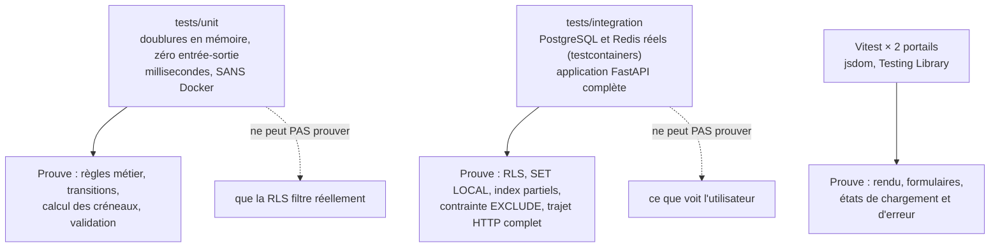

# Stratégie de tests

## La pyramide du projet



## `tests/unit` — rapide, sans Docker

Les use cases y sont exercés avec des **doublures en mémoire** (`tests/unit/*/fakes.py`)
qui implémentent les mêmes ports que les repositories réels. Aucune base, aucun réseau.

C'est ce niveau qui bénéficie directement de l'architecture hexagonale : parce que
`domain/` n'importe aucun framework, tester `Appointment.cancel_by_owner()` ne demande
rien d'autre qu'un objet et une date.

```bash
make test-unit
```

Le port `Clock` prend ici tout son sens : figer le temps rend déterministe une règle
comme « au moins 24 heures avant le début », qui dépendrait sinon de la date d'exécution
de la suite.

## `tests/integration` — PostgreSQL réel, jamais SQLite

```bash
make test-integration   # Docker requis
```

testcontainers démarre de vrais conteneurs PostgreSQL et Redis, applique les migrations
Alembic, puis exerce l'application FastAPI complète : HTTP → use case → SQLAlchemy →
PostgreSQL.

:::danger Pourquoi SQLite est exclu
La RLS, `SET LOCAL`, `JSONB` et les index uniques partiels **ne sont pas émulables** par
SQLite. Un test SQLite donnerait une confiance fausse précisément sur les mécanismes de
sécurité — c'est-à-dire au pire endroit possible. Voir
[ADR-0008](../adr/0008-testcontainers-plutot-que-sqlite.md).
:::

Le coût est maîtrisé par la portée des fixtures : les conteneurs et les migrations sont
en `scope="session"` et ne tournent qu'une fois pour toute la suite. L'isolation entre
tests est assurée par un `TRUNCATE` des tables avant chaque test.

Les sept fichiers actuels couvrent les flux critiques :

| Fichier                          | Ce qu'il prouve                                                     |
| -------------------------------- | ------------------------------------------------------------------- |
| `test_rls_isolation.py`          | Une clinique ne voit rien d'une autre, même sans clause de filtrage |
| `test_auth_flow.py`              | Connexion, rafraîchissement, déconnexion côté personnel             |
| `test_owner_auth_flow.py`        | Idem côté propriétaires, et le cloisonnement des deux espaces       |
| `test_scheduling_flow.py`        | Réservation, confirmation, annulation, anti-double-réservation      |
| `test_scheduling_permissions.py` | Un rôle insuffisant reçoit bien un `403`                            |
| `test_pets_flow.py`              | Le filtrage applicatif par `owner_id`                               |
| `test_clinics_me.py`             | Lecture et mise à jour du profil de clinique                        |

## Les tests frontend

Vitest en environnement `jsdom`, avec Testing Library. Configuration `globals: false` :
chaque test importe explicitement `describe`, `it` et `expect` depuis `vitest`. C'est
aussi la raison des doublures manuelles de `localStorage` et de `matchMedia` dans
`vitest.setup.ts`.

```bash
make test-front        # rapide, sans couverture
make coverage-front    # avec couverture et seuils : ce que fait la CI
```

## La couverture et ses seuils

| Périmètre              | Seuil                         | Mesure de référence                   |
| ---------------------- | ----------------------------- | ------------------------------------- |
| Backend (`fail_under`) | **85 %**                      | 87 % au 2026-08-21                    |
| `frontend-b2c`         | st 62 / br 60 / fn 58 / li 63 | st 64,7 / br 63,2 / fn 60,7 / li 65,4 |
| `frontend-b2b`         | st 63 / br 59 / fn 56 / li 63 | st 65,1 / br 62,2 / fn 58,0 / li 65,5 |

La méthode est constante : **on mesure, puis on pose le seuil deux points en dessous**
(trois pour les branches, dont les compteurs v8 bougent au gré de la chaîne de
compilation). Assez serré pour attraper une régression franche, assez lâche pour ne pas
transformer chaque demande de fusion en négociation.

Côté backend, la couverture est **consolidée** : les tests unitaires et d'intégration
tournent sur deux exécuteurs distincts en CI, chacun produit une mesure partielle, et
`coverage combine` les fusionne avant d'appliquer le seuil. C'est ce que permet
`relative_files = true` dans `pyproject.toml`.

Les seuils frontend sont **globaux, volontairement** : des seuils par dossier
demanderaient une mesure par dossier, et poser des chiffres non mesurés les rendrait
indiscernables de chiffres négociés.

:::warning La règle de gouvernance des seuils
**Ne jamais baisser un seuil dans la demande de fusion qui l'a cassé.** Si un abaissement
est justifié, il fait l'objet d'un commit dédié, daté et commenté. Sans cette règle, un
seuil devient une formalité qu'on ajuste à la baisse jusqu'à ce qu'il ne mesure plus rien.
:::

## Ce que la CI en fait

| Job                             | Contenu                                                                 |
| ------------------------------- | ----------------------------------------------------------------------- |
| `backend - tests unitaires`     | `pytest tests/unit`, produit `.coverage.unit`                           |
| `backend - tests d'integration` | `pytest tests/integration`, produit `.coverage.integration`             |
| `backend - couverture`          | Récupère les deux, `coverage combine`, applique `fail_under`            |
| `frontend - <app>`              | ESLint, build, `tsc`, Vitest avec seuils, pour chacun des deux portails |

Voir [Le pipeline d'intégration continue](../exploitation/pipeline-ci.md).
