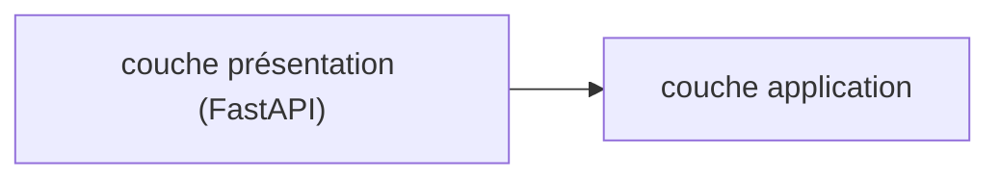

# Rédiger cette documentation

## La structure du dossier

```text
documentation/
├── .nvmrc                  # 24
├── .prettierignore
├── docusaurus.config.ts    # toute la configuration du site
├── sidebars.ts             # une seule barre latérale, AUTO-GÉNÉRÉE
├── i18n/fr/code.json       # libellés français de la barre de recherche
├── src/css/custom.css      # UNIQUEMENT des variables --ifm-*
├── src/pages/index.tsx     # la page d'accueil
├── static/img/
└── docs/                   # tout le contenu
    ├── intro.md
    └── <categorie>/
        ├── _category_.json
        └── <page>.md
```

## Lancer le site

```bash
make docs          # serveur de développement, :3002
make docs-build    # build de production — c'est lui qui attrape les liens morts
make docs-serve    # sert le build, exactement comme il sera en ligne
make check-docs    # format + types + build : le job CI
```

Toutes ces cibles régénèrent d'abord `backend/openapi.json`, dont la référence d'API a
besoin.

## Ajouter une page

Créez un `.md` dans la bonne catégorie, avec un en-tête minimal :

```yaml
---
sidebar_position: 5
title: "Isolation multi-tenant et Row-Level Security"
sidebar_label: "Multi-tenant et RLS"
description: "Comment PostgreSQL garantit qu'une clinique ne peut pas lire une autre."
keywords: [rls, multi-tenant, postgresql]
---
```

:::warning Quotez toujours `title` et `description`
Un `:` dans une valeur **non quotée** casse l'analyse YAML — le parseur y voit un
`clé: valeur`. C'est l'erreur la plus fréquente, et son message est peu parlant.
:::

Rien d'autre à faire : la barre latérale est **auto-générée** depuis l'arborescence. Une
page créée apparaît automatiquement — c'est précisément pour éviter la panne inverse, une
page en ligne mais invisible parce qu'on a oublié de la déclarer.

Pour une nouvelle catégorie, ajoutez un `_category_.json` :

```json
{
  "label": "Ma catégorie",
  "position": 10,
  "collapsed": false,
  "link": {
    "type": "generated-index",
    "title": "Ma catégorie",
    "description": "Une phrase.",
    "slug": "/ma-categorie"
  }
}
```

## `.md` ou `.mdx` ?

La configuration pose `markdown.format: 'detect'` :

- **`.md` = CommonMark pur.** Les `<` et les `{` y sont du texte ordinaire. C'est le format
  par défaut, et il évite des heures perdues : sans lui, « annulation `<` 24 h » ou « le
  paramètre `{clinic_id}` » casseraient le build avec un message de parseur illisible ;
- **`.mdx` = JSX.** À réserver aux pages qui ont réellement besoin d'un `import` ou d'un
  composant React.

Les admonitions (`:::note`, `:::warning`, `:::danger`, `:::tip`) et les blocs Mermaid
fonctionnent parfaitement en CommonMark.

## Les liens internes

**La règle** : un chemin de fichier **relatif**, avec l'extension.

```markdown
[le UoW](../architecture/multi-tenant-et-rls.md)
```

Docusaurus le résout à la compilation, il survit à un déplacement de page, et il est
vérifié au build.

**À proscrire** : `/docs/architecture/...` en dur — cela casse si `baseUrl` change — et
les URL absolues vers le site publié, qui ne sont jamais vérifiées et sont fausses en
local.

Dans `docusaurus.config.ts` et `index.tsx`, en revanche, les `to=` sont des **routes** :
`to="/docs/demarrer/installation"`, sans le `/VetLib/` que `<Link>` préfixe tout seul.

:::danger Le build échoue sur un lien ou une ancre morts
`onBrokenLinks`, `onBrokenAnchors`, `onBrokenMarkdownLinks` et `onBrokenMarkdownImages`
sont tous réglés sur `throw`. Renommer un titre casse donc le build tant que les liens
entrants ne sont pas corrigés — c'est le principal filet de sécurité de ce site.

Ce contrôle n'existe **qu'au build de production**. `make docs` ne le fait pas : c'est
pourquoi `make check-docs` lance un vrai `docs-build`.
:::

## Les images

Placez-les dans `static/img/` et référencez-les **sans** le `baseUrl` :

```markdown

```

Écrire `/VetLib/img/...` produirait `/VetLib/VetLib/img/...`. En TSX, passez par
`useBaseUrl('/img/...')` plutôt que de concaténer à la main.

Ne pointez jamais vers une image située **hors** de `documentation/` : le build ne la
copierait pas.

**Préférez Mermaid aux captures d'écran** pour tout ce qui touche à l'architecture : les
schémas restent lisibles en mode sombre, se comparent en revue, et ne périment pas
silencieusement.

## Écrire un diagramme Mermaid

````markdown

````

Quatre points d'attention :

1. **Mettez les libellés entre guillemets** dès qu'ils contiennent une parenthèse, une
   barre oblique ou des accents. Sinon le parseur Mermaid part en erreur.
2. **Un diagramme invalide ne fait PAS échouer le build** : il affiche un cadre d'erreur
   rouge dans la page publiée. Relisez donc visuellement après `make docs-serve`.
3. **Mermaid est rendu côté navigateur** : le diagramme est absent du HTML statique, donc
   invisible pour la recherche et pour un lecteur d'écran. **Doublez toujours un schéma
   d'un paragraphe de texte** — c'est une exigence d'accessibilité autant que de qualité.
4. Mermaid pèse environ 500 ko de JavaScript, chargé uniquement sur les pages qui en
   contiennent. N'en mettez pas partout.

## La recherche

Elle est **entièrement hors ligne** : l'index est construit au build et servi avec le
site, sans compte Algolia ni requête vers un tiers.

:::note La recherche ne fonctionne pas avec `make docs`
L'index n'est produit qu'à l'étape `postBuild`. En développement, la barre existe mais ne
renvoie rien. Testez avec `make docs-serve`.
:::

Les libellés français de la barre vivent dans `i18n/fr/code.json` : le paquet de recherche
ne fournit pas de locale française. Les libellés du thème lui-même — navigation,
pagination, « Modifier cette page », admonitions — sont déjà traduits par Docusaurus.

## La référence d'API

Elle n'est **jamais écrite à la main** : elle est produite au build par `redocusaurus` à
partir de `backend/openapi.json`, exactement comme le client Orval est produit à partir du
même contrat.

Ce fichier est volontairement non versionné. Sur un dépôt fraîchement cloné :

```bash
make openapi          # écrit backend/openapi.json
make docs             # la route /api existe
```

Sans lui, le site se construit quand même, avec un avertissement, et **sans** la route
`/api` ni son entrée de navigation. C'est délibéré : corriger une faute de frappe dans un
`.md` ne doit pas obliger à installer Python et uv. En CI, en revanche, l'absence du
fichier fait **échouer** le build — le site publié ne doit jamais perdre silencieusement
sa référence d'API.

## Prettier

```bash
make docs-format   # reformate
make check-docs    # vérifie (entre autres)
```

Deux pièges connus :

- **Prettier reformate le contenu des blocs de code** dont il connaît le langage
  (`ts`, `tsx`, `json`, `yaml`, `css`). Un extrait volontairement tronqué ou
  syntaxiquement invalide fera échouer `--check`. Utilisez alors `text, `console, ou
  un commentaire `<!-- prettier-ignore -->` avant le bloc.
- **`.prettierignore` est indispensable** et local au dossier : Prettier résout ses
  fichiers d'exclusion depuis son répertoire de travail, il ne voit donc pas le
  `.gitignore` de la racine du dépôt.

## Le style de ce site

- **Français**, y compris dans les titres et les libellés de diagrammes.
- On explique le **pourquoi**, pas seulement le quoi — c'est ce qui rend le corpus de
  commentaires du dépôt si utile, et ce site en est le prolongement.
- On cite le code **réel**, avec son chemin, plutôt que de le paraphraser.
- On lie vers l'[ADR](../adr/index.md) correspondant quand une page décrit une décision.

:::danger Ce site est public
Le dépôt est public, ce site aussi. Aucun secret, aucune URL interne, aucun nom de client
réel dans les pages.
:::
