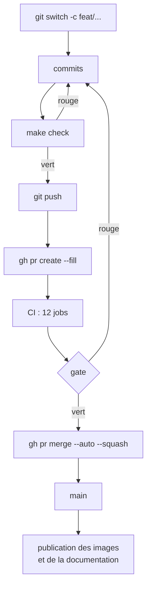

# Contribuer : de la branche à la fusion

## `main` est protégée

Le `push` direct sur `main` est **refusé** par un ruleset GitHub. Toute modification passe
par une branche et une demande de fusion, qui ne peut être fusionnée que si la CI est
verte.

Le ruleset impose, en plus :

- la **fusion par écrasement** (_squash_) uniquement, et un historique linéaire ;
- la résolution de tous les fils de commentaires ;
- ni suppression ni réécriture forcée de la branche.

**Zéro approbation** est requise : le projet a un seul contributeur, et GitHub ne demande
jamais de relecture à l'auteur d'une demande de fusion. La règle « review from Code
Owners » est d'ailleurs volontairement désactivée — sans cela, plus aucune demande ne
serait fusionnable.

## Le cycle



```bash
git switch -c feat/ma-fonctionnalite
make check                       # à lancer AVANT de pousser
git push -u origin feat/ma-fonctionnalite
gh pr create --fill
gh pr merge --auto --squash      # fusionne dès que la CI passe au vert
```

`--auto` est le confort principal : la fusion part toute seule quand `gate` devient vert,
sans avoir à surveiller.

## Nommer branches et commits

Les préfixes de branche suivent le type de changement : `feat/`, `fix/`, `refactor/`,
`docs/`, `chore/`, `ci/`.

Les messages de commit suivent la convention **Conventional Commits**, avec une portée
entre parenthèses et un sujet **en français**. Relevé de l'historique :

```text
feat(b2b): agenda en grille horaire et tableau de bord de la journee
fix(scheduling): lecture des praticiens et types ouverte a tout le staff
test(front): couverture des frontends portée à 65 %, verrouillée par un seuil
chore(ci): aligner @types/node sur le runtime du projet
docs: espaces d'auth staff/owner dans CLAUDE.md
```

Les portées observées : `b2b`, `b2c`, `admin`, `backend`, `scheduling`, `front`, `ci`,
`deps`, `deps-dev`. Dependabot utilise `chore(deps)`, `chore(deps-dev)` et `ci(deps)`,
configurés dans `dependabot.yml`.

## La checklist de la demande de fusion

Le gabarit est pré-rempli par `gh pr create --fill`. Trois sections.

**Type de changement** — `feat`, `fix`, `refactor`, `docs` / `chore` / `ci`.

**Vérifications** :

- `make check` passe en local ;
- `make test-integration` si le backend ou le schéma a changé ;
- migration Alembic ajoutée si un modèle a changé, **et un seul `head`** ;
- `make generate-api` relancé et **les trois** clients committés, si un endpoint a changé ;
- commentaires pédagogiques en français sur tout code nouveau ou modifié ;
- composants `shadcn/ui` + Tailwind côté frontend, pas de CSS maison.

**Impact multi-tenant et sécurité** :

- nouvelle table tenantée : colonne `clinic_id`, politique RLS, `GRANT` sans `DELETE` ;
- aucun jeton dans un corps JSON.

Cette dernière section est la plus utile : elle force à se poser la question de
l'isolation **avant** la fusion, pas après.

## Ajouter un job à la CI

Deux règles, et une exception.

1. **Tout nouveau job de contrôle doit entrer dans la liste `needs:` de `gate`.** Sinon
   son échec passerait totalement inaperçu — `gate` ne regarde que ses `needs`.
2. **Aucun job conditionnel ne doit y entrer.** Il serait _skipped_ sur les demandes de
   fusion, et `gate` échouerait à cause de la clause `contains(needs.*.result, 'skipped')`.

L'exception, ce sont les **jobs d'après-fusion** — `publier les images` et `publier la
documentation`. Ils dépendent de `gate` au lieu d'y être listés :

```yaml
needs: [gate]
if: >-
  always()
  && needs.gate.result == 'success'
  && github.event_name == 'push'
  && github.ref == 'refs/heads/main'
```

Voir [Le pipeline d'intégration continue](../exploitation/pipeline-ci.md).

## Débloquer une CI cassée

Il n'y a **volontairement pas** de contournement silencieux. Si la CI est cassée au point
de bloquer tout le monde, la procédure est explicite : désactiver temporairement le
ruleset, puis le réactiver.

```bash
gh api --method PUT repos/kederiku/VetLib/rulesets/<id> --input -   # {"enforcement":"disabled"}
```

Renommer le job `gate` demande la même précaution, dans cet ordre :

1. désactiver le ruleset ;
2. fusionner le renommage ;
3. relever le nouveau nom —
   `gh api repos/kederiku/VetLib/commits/main/check-runs --jq '.check_runs[].name'` ;
4. réappliquer le ruleset avec le nouveau nom.

## Signaler un problème

Deux gabarits d'issue sont disponibles dans l'onglet _Issues_ : rapport de bogue et
demande de fonctionnalité.

## Gouvernance et licence

`CODEOWNERS` attribue tout le dépôt à `@kederiku`, avec trois zones sensibles
explicitées : `/.github/`, `/backend/migrations/` et `/docker/`. Le fichier ne bloque rien
aujourd'hui — il documente la responsabilité et deviendra utile dès qu'une seconde
personne rejoindra le projet.

Le projet est publié sous **licence [MIT](https://github.com/kederiku/VetLib/blob/main/LICENSE)**,
© 2026 Cédric Delagrée. Chacun peut donc lire, réutiliser, modifier et redistribuer ce
code, y compris à des fins commerciales, à la seule condition de conserver l'avis de
copyright.

Le choix et les alternatives écartées sont consignés dans
[ADR-0011](../adr/0011-licence-du-depot.md).

:::note Contribuer, c'est accepter la licence
En proposant une modification, vous acceptez qu'elle soit distribuée sous cette même
licence. C'est la convention implicite de tout dépôt licencié ; un accord de licence
contributeur formel deviendrait utile le jour où plusieurs personnes contribueraient
régulièrement.
:::
