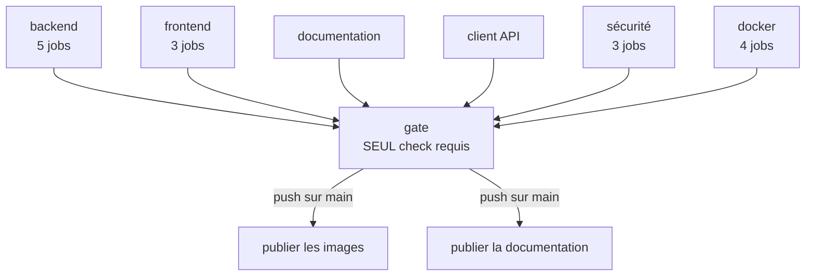

# Le pipeline d'intégration continue

Un seul workflow, `.github/workflows/ci.yml`, déclenché sur chaque demande de fusion,
sur chaque `push` vers `main`, et manuellement.

## Le graphe



Les douze jobs sont regroupés ici par famille ; le tableau ci-dessous les détaille un
par un. Ce que le schéma montre, et qui compte davantage : **tout converge vers un seul
job**, et rien n'est publié tant qu'il n'est pas vert.

## Ce que chaque contrôle empêche

| Contrôle                                   | Ce qu'il empêche                                                  |
| ------------------------------------------ | ----------------------------------------------------------------- |
| ruff + `ruff format --check`               | Du code Python hors conventions                                   |
| mypy strict                                | Des erreurs de typage                                             |
| `pytest tests/unit`                        | Une régression de la logique métier                               |
| `pytest tests/integration`                 | Une régression sur PostgreSQL réel : RLS, index partiels          |
| Couverture consolidée                      | Une chute de la couverture backend sous 85 %                      |
| Migrations Alembic                         | Deux `head`, une migration irréversible, un modèle sans migration |
| ESLint, build, `tsc`, Vitest (× 3)         | Une régression frontend                                           |
| Couverture frontend                        | Une chute sous le seuil de chacune des trois applications         |
| Dérive du client Orval                     | Un endpoint modifié sans `make generate-api`                      |
| Prettier, `tsc`, build Docusaurus          | Une documentation mal formée, un lien ou une ancre morte          |
| pip-audit, npm audit, revue de dépendances | Une dépendance vulnérable                                         |
| actionlint + zizmor                        | Un workflow cassé ou vulnérable                                   |
| Construction des quatre images             | Une image qui ne se construit plus                                |

## Le job `gate`

Tous ces contrôles convergent vers **un seul** job, `gate`, et c'est lui seul que la
protection de branche exige. On peut donc ajouter ou retirer des contrôles **sans jamais
toucher aux réglages du dépôt**.

```yaml
gate:
  name: gate
  runs-on: ubuntu-24.04
  timeout-minutes: 5
  permissions: {} # ce job ne clone rien et n'appelle aucune API
  needs: [...] # cette liste doit rester EXHAUSTIVE
  if: always()
```

:::danger `gate` ne doit **jamais** être renommé
Le nom `gate` est le check requis déclaré dans le ruleset GitHub. Le changer rendrait le
check introuvable et bloquerait **toutes** les demandes de fusion, sans message d'erreur
explicite. La procédure de renommage d'urgence est dans
[Contribuer](../contribuer/workflow-de-contribution.md).
:::

### Pourquoi `if: always()`

Sans `always()`, un job en échec parmi les `needs` **annulerait** `gate`, qui resterait à
l'état _skipped_. Or **GitHub considère un check ignoré comme réussi** : la demande de
fusion redeviendrait fusionnable alors que la CI est rouge.

`!cancelled()` ne conviendrait pas non plus : une annulation du run rendrait `gate`
lui-même ignoré, donc vert.

`always()` seul rendrait cependant `gate` vert quoi qu'il arrive. C'est l'étape suivante
qui traduit réellement les résultats :

```yaml
if: >-
  contains(needs.*.result, 'failure')
  || contains(needs.*.result, 'cancelled')
  || (github.event_name == 'pull_request' && contains(needs.*.result, 'skipped'))
run: |
  echo "::error::Au moins un job de la CI n'est pas passe."
  exit 1
```

### Le corollaire à connaître

La clause `skipped` a une conséquence directe : **un job conditionnel ne doit jamais
entrer dans les `needs` de `gate`**. Il serait ignoré sur les demandes de fusion, et
ferait donc échouer la porte.

C'est exactement pourquoi les deux jobs de publication sont **hors** de cette liste et
dépendent de `gate` à la place :

```yaml
needs: [gate]
if: >-
  always()
  && needs.gate.result == 'success'
  && github.event_name == 'push'
  && github.ref == 'refs/heads/main'
```

## Pourquoi aucun filtre `paths:`

Le fichier le documente en tête, et c'est contre-intuitif : **un workflow filtré par
chemin ne se déclenche pas** sur les demandes de fusion qui ne touchent pas ces chemins.
Le check requis ne serait alors **jamais** rapporté, et la demande resterait bloquée « en
attente » pour toujours, sans message d'erreur.

Tous les jobs tournent donc sur toutes les demandes de fusion. C'est un peu de temps
machine contre l'impossibilité d'un blocage silencieux.

## Les conventions du workflow

| Convention                                                | Raison                                                                             |
| --------------------------------------------------------- | ---------------------------------------------------------------------------------- |
| Actions **épinglées par SHA**, avec un commentaire `# vX` | Une étiquette Git peut être déplacée ; un SHA, non                                 |
| `persist-credentials: false` sur tout `checkout`          | Exigence de zizmor : ne pas laisser un jeton dans `.git/config`                    |
| `runs-on: ubuntu-24.04`, jamais `ubuntu-latest`           | Une image d'exécuteur qui change sous les pieds est une source de rouge inexpliqué |
| `timeout-minutes` sur **100 %** des jobs                  | Un job bloqué consomme des minutes jusqu'au délai global                           |
| Permissions minimales, élevées **au niveau du job**       | Le workflow reste en `contents: read`                                              |
| Commentaires et `name:` **sans accents**                  | Les fichiers de workflow sont ASCII                                                |

Deux outils gardent ces règles :

```bash
docker run --rm -v "$PWD:/repo" --workdir /repo rhysd/actionlint:1.7.12 -color
uvx zizmor@1.29.0 --min-severity medium .github/workflows/
```

`actionlint` valide la syntaxe et les références ; `zizmor` cherche les motifs
dangereux — injection dans un `run:`, permissions excessives, actions non épinglées.

## Après la fusion

Deux publications, toutes deux conditionnées à un `gate` vert et à un `push` sur `main`.

**Les images**, sur GHCR : `ghcr.io/kederiku/vetlib-api`, `-portal`, `-clinic` et
`-admin`, étiquetées `latest` et `sha-<commit>`.

**Ce site**, sur GitHub Pages. Le job de publication ne reconstruit **rien** : il déploie
l'artefact déjà produit par le job `documentation` du même run.

Une CI rouge ne met donc jamais rien en ligne.

## CodeQL, à part

`.github/workflows/codeql.yml` analyse Python et TypeScript sur chaque demande de fusion
et chaque lundi à 4 h 17 UTC (une heure volontairement non ronde, pour éviter
l'embouteillage des crons à heure pile).

Il est **hors** du `gate`, pour une raison précise : il exige `security-events: write`,
une permission qu'on ne veut pas accorder au workflow qui exécute le code des demandes de
fusion.

Sa configuration exclut les dossiers qui ne sont pas écrits à la main — le client Orval,
les composants shadcn, les migrations : y signaler une alerte n'apporterait rien, et le
bruit finirait par masquer les vraies.

## Reproduire la CI en local

```bash
make check          # tout ce qui ne demande pas Docker — le plus utile au quotidien
make check-all      # + tests d'intégration + contrôle des migrations
make coverage       # couverture backend consolidée
make coverage-front # couverture des trois applications, avec les seuils
make check-docs     # format, types et build de ce site
make audit          # vulnérabilités des dépendances
```

Voir [ADR-0010](../adr/0010-un-seul-check-requis-gate.md).
