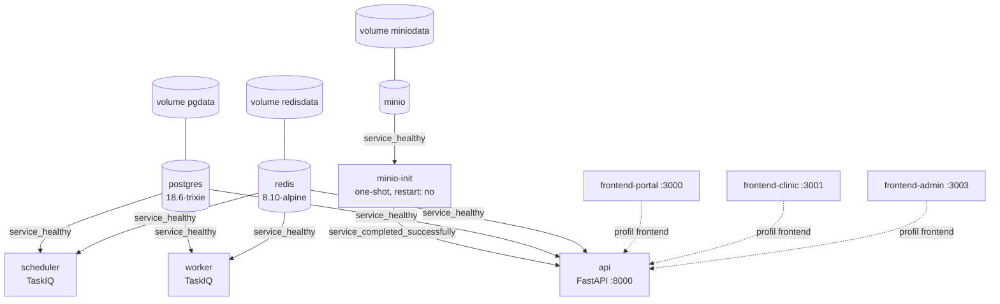

# La pile Docker

## Les services



| Service           | Image / construction                | Rôle                                         |
| ----------------- | ----------------------------------- | -------------------------------------------- |
| `postgres`        | `postgres:18.6-trixie`              | La base, et la clé de voûte du multi-tenant  |
| `redis`           | `redis:8.10.0-alpine3.23`           | Courtier TaskIQ, `--appendonly yes`          |
| `minio`           | `minio/minio`                       | Stockage objet S3, console sur `:9001`       |
| `minio-init`      | `minio/mc`                          | Crée le bucket, puis **se termine**          |
| `api`             | construit, cible `dev`              | FastAPI sur `:8000`                          |
| `worker`          | même image                          | Consomme les tâches, dont le relais d'outbox |
| `scheduler`       | même image                          | Déclenche les tâches périodiques             |
| `frontend-portal` | construit, `APP_DIR=frontend-b2c`   | Profil `frontend` uniquement                 |
| `frontend-clinic` | construit, `APP_DIR=frontend-b2b`   | Profil `frontend` uniquement                 |
| `frontend-admin`  | construit, `APP_DIR=frontend-admin` | Profil `frontend` uniquement                 |

## L'ordre de démarrage n'est pas une suggestion

```yaml
depends_on:
  postgres:
    condition: service_healthy
  redis:
    condition: service_healthy
  minio-init:
    condition: service_completed_successfully
```

Deux conditions distinctes, deux sémantiques :

- **`service_healthy`** attend que la **sonde** du service passe au vert — pas seulement
  que le conteneur soit lancé. `pg_isready` pour PostgreSQL, `redis-cli ping` pour Redis.
  Sans cela, l'API démarrerait avant que la base n'accepte les connexions et planterait.
- **`service_completed_successfully`** attend qu'un conteneur **éphémère** ait terminé
  avec un code de sortie nul. C'est le cas de `minio-init`, qui crée le bucket et s'arrête.

`minio-init` porte `restart: "no"` : sans cela, Docker le relancerait indéfiniment, son
travail étant par nature terminé.

## Les ancres YAML

Le fichier ouvre sur deux ancres, `x-backend-env` et `x-backend-build`, réutilisées par
`api`, `worker` et `scheduler`. Une ancre YAML est un bloc nommé qu'on injecte ailleurs
avec `<<: *nom`.

C'est ce qui garantit que les trois services partagent **exactement** la même
configuration et la même image : une divergence entre l'API et le worker sur l'URL de la
base serait particulièrement pénible à diagnostiquer.

## Les scripts d'initialisation de PostgreSQL

`docker/postgres-init/` est monté en lecture seule dans le conteneur. L'image PostgreSQL
exécute ces scripts **une seule fois**, au tout premier démarrage sur un volume vide.

| Script              | Contenu                                                                         |
| ------------------- | ------------------------------------------------------------------------------- |
| `01-extensions.sql` | Les extensions PostgreSQL nécessaires                                           |
| `02-app-role.sh`    | Crée le rôle `vetolib_app` (`NOLOGIN NOBYPASSRLS`) et ses privilèges par défaut |

:::caution Ils ne sont rejoués que sur un volume vide
Modifier un de ces scripts n'a **aucun effet** sur une base déjà initialisée. Il faut
`make down-volumes`, ce qui détruit les données locales.
:::

Les migrations Alembic reposent le `GRANT` et la politique RLS de chaque table de toute
façon — précisément parce que les privilèges par défaut du script Docker ne couvrent pas
les bases éphémères créées par testcontainers.

## Les images

### Backend — une image, trois services

`docker/backend/Dockerfile`, multi-étapes : `base → deps → dev | prod`, sur
`python:3.13.15-slim-trixie`. `uv` est copié depuis une image officielle plutôt
qu'installé par un script.

```dockerfile
RUN --mount=type=cache,target=/root/.cache/uv \
    ...
```

Le montage de cache BuildKit fait persister le cache de `uv` **entre les constructions**,
sans le stocker dans une couche d'image. Une reconstruction après un simple changement de
code ne retélécharge rien.

L'image de production lance :

```dockerfile
CMD ["uvicorn", "vetolib.main:app", "--host", "0.0.0.0", "--port", "8000",
     "--proxy-headers", "--forwarded-allow-ips=*"]
```

`--proxy-headers` est indispensable derrière un terminateur TLS : sans lui, uvicorn
croirait servir en HTTP et les cookies `Secure` seraient mal gérés.

Les trois services `api`, `worker` et `scheduler` partagent cette image et ne diffèrent
que par leur commande.

### Frontend — un seul Dockerfile pour les trois applications

```dockerfile
ARG APP_DIR
FROM node:24.19-alpine3.24 AS base
```

`APP_DIR` vaut `frontend-b2c`, `frontend-b2b` ou `frontend-admin`. Un seul fichier à
maintenir, et la garantie que les trois images se construisent de la même façon.

Étapes : `base → deps → dev`, et `base → deps → builder → runner`. L'étape `runner`
exploite la sortie **standalone** de Next.js (`output: "standalone"` dans
`next.config.ts`) : Next produit un `server.js` avec uniquement les dépendances
réellement utilisées, ce qui réduit fortement l'image finale.

La version de Node est alignée sur les `.nvmrc` — et Dependabot ignore la majeure de
l'image, pour que cet alignement ne se défasse pas tout seul.

## Volumes et réseau

Trois volumes nommés : `pgdata`, `redisdata`, `miniodata`. Le réseau par défaut s'appelle
`vetolib`.

```bash
make down           # arrête, GARDE les données
make down-volumes   # arrête ET supprime les volumes
```

:::note Le volume PostgreSQL 18
Il est monté sur `/var/lib/postgresql`, et non `/var/lib/postgresql/data` : l'image 18 a
changé son agencement. C'est un détail qui coûte cher si on le découvre après coup, et
qui est commenté dans `docker-compose.yml`.
:::

## Le profil `frontend`

```bash
docker compose --profile frontend up -d   # ou : make up-full
```

Les trois services de frontend portent `profiles: ["frontend"]` : ils ne démarrent
**pas** avec un `docker compose up` ordinaire. En développement, on préfère
`make dev-b2c`, `make dev-b2b` et `make dev-admin`, hors Docker, pour un rechargement à
chaud plus rapide.
Le profil sert à la démonstration d'une pile complète.
