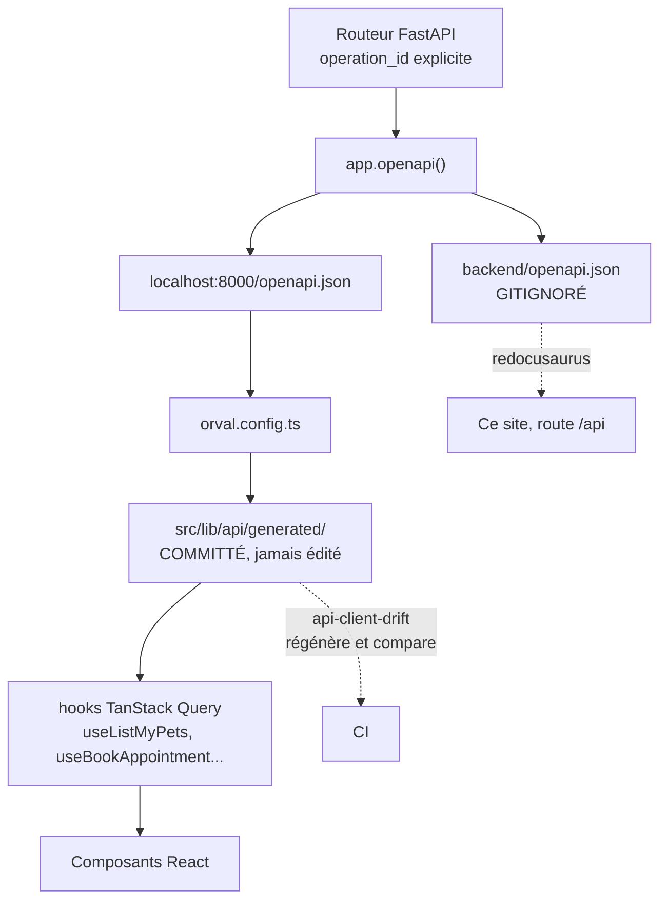

# Le client API généré par Orval

## La chaîne complète



## Pourquoi générer plutôt qu'écrire

Un client d'API écrit à la main se désynchronise. Pas immédiatement, pas
spectaculairement : un champ devenu optionnel ici, un statut ajouté là, et l'écart ne se
révèle qu'en production.

Le générer **au build** poserait un autre problème : la CI dépendrait d'un backend
démarré pour construire un frontend.

VetoLib prend la troisième voie : on génère **puis on committe**, et un job de CI détecte
la dérive. Voir [ADR-0009](../adr/0009-client-api-genere-et-commite.md).

## `operation_id` → nom du hook

C'est le point de contact entre les deux mondes, et la raison de la convention backend
« toujours un `operation_id` explicite » :

| `operation_id` FastAPI | Hook généré             |
| ---------------------- | ----------------------- |
| `listMyPets`           | `useListMyPets`         |
| `bookAppointment`      | `useBookAppointment`    |
| `confirmAppointment`   | `useConfirmAppointment` |
| `getCurrentOwner`      | `useGetCurrentOwner`    |

Sans `operation_id` explicite, FastAPI en fabrique un à partir du nom de fonction et du
chemin : illisible, et instable au moindre remaniement.

:::warning Renommer un `operation_id` est un changement cassant
Le hook est renommé dans les **deux** portails, et tous ses appels cessent de compiler.
C'est visible et rattrapable — mais à faire sciemment.
:::

## La configuration

Les deux `orval.config.ts` sont identiques :

```ts
export default defineConfig({
  vetolib: {
    input: { target: "http://localhost:8000/openapi.json" },
    output: {
      target: "src/lib/api/generated",
      mode: "tags-split",
      client: "react-query",
      httpClient: "fetch",
      clean: true,
      override: {
        mutator: { path: "src/lib/api/mutator.ts", name: "customFetch" },
      },
    },
    hooks: { afterAllFilesWrite: "prettier --write" },
  },
});
```

| Option                  | Effet                                                                                                        |
| ----------------------- | ------------------------------------------------------------------------------------------------------------ |
| `input.target`          | Le schéma **servi en direct** par le backend, pas un fichier sur disque. L'API doit donc tourner             |
| `mode: "tags-split"`    | Un sous-dossier par tag OpenAPI, ce qui **calque le découpage en bounded contexts**                          |
| `client: "react-query"` | Des hooks `useQuery` / `useMutation` prêts à l'emploi : cache, invalidation, états de chargement et d'erreur |
| `httpClient: "fetch"`   | `fetch` natif, pas d'axios                                                                                   |
| `clean: true`           | Vide le dossier avant génération : un endpoint supprimé côté backend disparaît du client                     |
| `override.mutator`      | **Le point clé** : chaque appel passe par `customFetch`                                                      |
| `afterAllFilesWrite`    | Prettier, pour que le dossier committé reste stable et les différences lisibles en revue                     |

Il n'y a délibérément **pas** d'`override.query` : les défauts d'Orval sont corrects
(`GET` → `useQuery`, le reste → `useMutation`). Les forcer tous les deux à `true`
produirait des `useQuery` sur des `POST`.

## Les tags, et donc les dossiers générés

| Tag                                 | Contexte                             |
| ----------------------------------- | ------------------------------------ |
| `auth`, `clinics`, `public-clinics` | `identity`, côté personnel et public |
| `owner-auth`, `owner-profile`       | `identity`, côté propriétaires       |
| `pets`                              | `patients`                           |
| `scheduling`, `owner-appointments`  | `scheduling`                         |
| `health`                            | `shared`                             |

## `generated/` est committé et **jamais** édité

Deux règles, également importantes :

- **committé** — les builds de CI et les images Docker ne dépendent pas d'un backend
  démarré ;
- **jamais édité à la main** — `clean: true` écraserait toute retouche à la génération
  suivante.

Le dossier est en conséquence exclu d'ESLint (`globalIgnores`), de la mesure de
couverture Vitest et de l'analyse CodeQL : y signaler une alerte n'aurait aucun sens,
puisqu'on ne peut pas la corriger sur place.

## Le job `api-client-drift`

La CI reproduit la génération et échoue si le résultat diffère de ce qui est committé :

```bash
uv sync --locked                    # dans backend/
make -C backend openapi             # produit backend/openapi.json
python3 -m http.server 8000 --directory backend &   # sert le fichier
npm ci && npm run generate:api      # dans chaque frontend
git status --porcelain -- frontend-b2c/src/lib/api/generated \
                          frontend-b2b/src/lib/api/generated
```

L'astuce du `http.server` évite de démarrer toute la pile : Orval n'a besoin que du
fichier `openapi.json`, servi sur le bon port.

Le job publie aussi le contrat en artefact (`openapi-schema`, sept jours), ce qui permet
de télécharger le contrat produit par une branche et de le comparer à celui de `main`.

## La procédure, après tout changement d'endpoint

```bash
make up                # l'API doit répondre sur :8000
make generate-api      # régénère les DEUX portails
git add frontend-b2c/src/lib/api/generated frontend-b2b/src/lib/api/generated
```

Puis vérifiez les appels : un champ renommé ou devenu obligatoire fait échouer
`tsc`, ce qui est exactement l'effet recherché.
