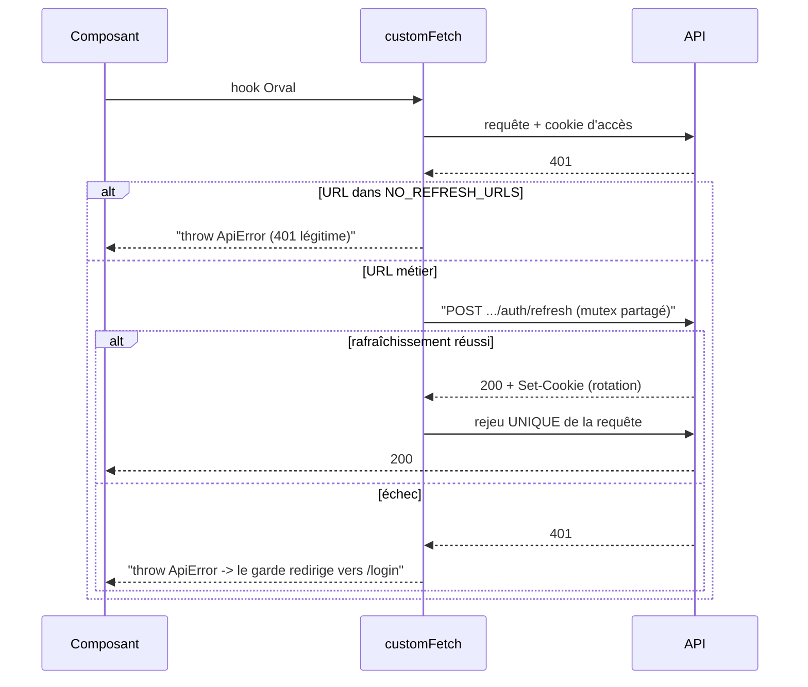

# Session et cookies côté client

Tous les appels HTTP d'un portail passent par **un seul point** : `customFetch`, dans
`src/lib/api/mutator.ts`. Chaque préoccupation transverse — URL de base, cookies,
désérialisation, rafraîchissement, normalisation des erreurs — s'y règle une fois, jamais
dans un composant.

## `credentials: "include"`, ou 401 partout

```ts
fetch(`${BASE_URL}${url}`, {
  ...options,
  credentials: "include",
  headers: { "Content-Type": "application/json", ...options.headers },
});
```

En développement, le portail (`:3000`) et l'API (`:8000`) sont **deux origines
différentes**. Sans `credentials: "include"`, le navigateur n'envoie pas les cookies et
n'accepte pas ceux de la réponse : toute route protégée répondrait `401`.

Notez ce qui **n'est pas** là : aucun en-tête `Authorization`. L'authentification repose
entièrement sur les cookies `HttpOnly`, que JavaScript ne peut pas lire — et donc pas
voler par XSS. Voir [Authentification](../architecture/authentification.md).

`BASE_URL` vient de `NEXT_PUBLIC_API_URL`. Le préfixe `NEXT_PUBLIC_` est ce qui autorise
Next.js à exposer la variable au navigateur ; elle est inlinée au build.

## Le rafraîchissement silencieux



### Les routes exclues

```ts
const NO_REFRESH_URLS = [
  "/api/v1/owner/auth/login",
  "/api/v1/owner/auth/refresh",
  "/api/v1/owner/auth/logout",
];
```

Sur ces trois routes, un `401` est une réponse **normale** — mauvais mot de passe,
session déjà close, jeton de rafraîchissement expiré — et non le signe d'un jeton
d'accès périmé. Tenter un rafraîchissement sur un `401` de `/refresh` **boucle à
l'infini**.

`/me` n'y figure volontairement **pas** : son `401` doit déclencher le rafraîchissement,
et c'est même le cas le plus fréquent — un retour sur le portail après plus de quinze
minutes.

### Un seul rejeu

Si le rejeu échoue encore, l'erreur remonte et le garde redirige vers la page de
connexion. Jamais de second rejeu : ce serait une boucle infinie si le compte est
réellement invalide.

### Le mutex

```ts
let refreshPromise: Promise<boolean> | null = null;

const refreshSession = (): Promise<boolean> => {
  if (refreshPromise === null) {
    refreshPromise = fetch(`${BASE_URL}${REFRESH_URL}`, {
      method: "POST",
      credentials: "include",
    })
      .then((response) => response.ok)
      .catch(() => false)
      .finally(() => {
        refreshPromise = null;
      });
  }
  return refreshPromise;
};
```

C'est le détail le plus important de ce fichier. Au chargement d'une page, plusieurs
requêtes partent en parallèle ; si le jeton d'accès est périmé, elles reçoivent **toutes**
un `401` en même temps.

Sans mutex, chacune lancerait son propre rafraîchissement. Or le backend fait **tourner**
le jeton de rafraîchissement : les rafraîchissements concurrents s'invalideraient
mutuellement, produisant des déconnexions apparemment aléatoires. Ici, le premier `401`
crée la promesse, les autres attendent **la même**.

La remise à `null` dans le `finally` est ce qui permet au prochain `401`, quinze minutes
plus tard, de relancer un vrai rafraîchissement au lieu de réutiliser une promesse déjà
résolue.

Une variable de module est sans danger côté navigateur : un seul utilisateur par
navigateur. Côté rendu serveur, ce code n'est jamais atteint — les Server Components
n'appellent pas l'API authentifiée.

## Pourquoi l'URL de rafraîchissement est en dur

```ts
const REFRESH_URL = "/api/v1/owner/auth/refresh";
```

Deux raisons, toutes deux structurelles :

1. importer `getOwnerRefreshTokenUrl()` depuis le code généré créerait un **cycle
   d'imports** — le généré importe déjà ce mutator ;
2. le cookie est émis avec `Path=/api/v1/owner/auth/refresh` : le navigateur ne le joint
   **que** sur cette URL exacte. La figer rend ce contrat visible et **intouchable par une
   régénération Orval**.

## Le portail B2C ne rafraîchit que la session propriétaire

Le client généré du B2C contient aussi les hooks du personnel (`/api/v1/auth/*`) —
Orval génère tout le contrat. Mais ce portail ne les utilise jamais, et son mutator ne
rafraîchit **que** la session propriétaire.

C'est délibéré : une session personnel éventuelle, si le même navigateur est connecté au
portail B2B, ne doit ni être touchée ni servir de session ici. Le cloisonnement des deux
espaces vaut aussi côté client.

## La désérialisation

```ts
if (response.status === 204) return undefined as T;

const contentType = response.headers.get("content-type");
if (contentType?.includes("application/json")) {
  const text = await response.text();
  return (text === "" ? undefined : JSON.parse(text)) as T;
}
if (contentType?.includes("application/pdf"))
  return response.blob() as Promise<T>;
return response.text() as Promise<T>;
```

On ne peut pas appeler `.json()` aveuglément : un `204 No Content` (la déconnexion) n'a
par définition pas de corps, et certaines routes futures renverront du PDF (les factures
du contexte `billing`). Le passage par `.text()` protège en plus du cas où un serveur
annonce du JSON mais renvoie un corps vide.

## Les erreurs sont **jetées**, jamais retournées

```ts
if (response.status >= 400) {
  throw apiErrorFromBody(response.status, data);
}
```

C'est le **contrat de TanStack Query** : une promesse rejetée fait passer la requête ou la
mutation en état `error` (`isError`, `onError`, réessais). Une promesse résolue serait
interprétée comme un succès, quel que soit le statut HTTP.

`apiErrorFromBody` normalise le corps `{ "code", "detail" }` produit par le backend en un
`ApiError` que les formulaires savent décoder — y compris les erreurs de validation
`422`. Voir
[Une requête HTTP, de bout en bout](../architecture/requete-de-bout-en-bout.md#8-les-erreurs-deviennent-des-statuts-http).
