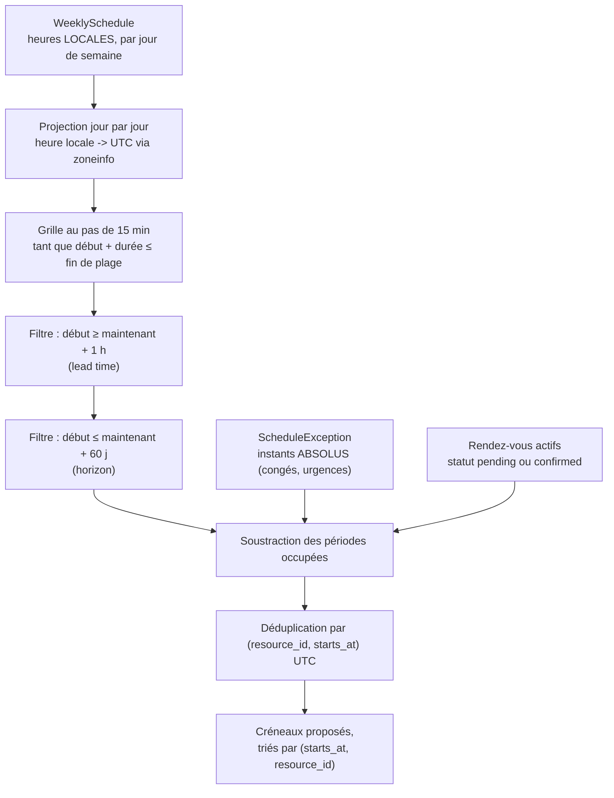

# Calcul des créneaux disponibles

## Calculés, jamais pré-générés

VetoLib ne stocke **aucun** créneau en base. Ils sont produits à la demande par une
fonction, `compute_available_slots`, dans
`backend/src/vetolib/scheduling/application/availability.py`.

Pré-générer aurait paru plus simple, et l'aurait été jusqu'au premier changement
d'horaire : il aurait fallu une table à maintenir, un remplissage rétroactif à chaque
modification d'un planning, une purge des créneaux périmés, et une gestion pénible de
l'heure d'été. Le calcul à la volée supprime tout cela.

Il a surtout une propriété décisive : c'est une **fonction pure**. Aucune
entrée-sortie, aucune dépendance à l'infrastructure — elle reçoit des données déjà
chargées et renvoie des créneaux en UTC. Elle se teste donc exhaustivement, en
millisecondes, sans base de données : passages à l'heure d'été, frontières de plage,
chevauchements, créneaux adjacents.

## Les trois sources croisées



L'indexation par ressource est faite dès l'entrée : **l'indisponibilité du Dr A ne
bloque jamais le Dr B**.

## Le rôle central du fuseau horaire

« Ouvert de 9 h à 12 h » est une heure **locale** à la clinique. L'instant UTC
correspondant change deux fois par an. C'est pourquoi :

- `weekly_schedules` stocke des `time` **sans** fuseau — des heures locales ;
- `schedule_exceptions` stocke des `timestamptz` — des instants absolus ;
- `clinics` porte un fuseau IANA (`Europe/Paris` par défaut), ajouté par la migration
  `0003` précisément en prévision de l'agenda.

La conversion se fait **jour par jour**, jamais avec un décalage fixe :

```python
window_start = datetime.combine(day, schedule.slot.start_time, tzinfo=tz).astimezone(UTC)
window_end = datetime.combine(day, schedule.slot.end_time, tzinfo=tz).astimezone(UTC)
```

## Les deux pièges du changement d'heure

### Passage à l'heure d'été (_spring forward_)

Une nuit de mars, 02 h 00 devient 03 h 00 : l'heure locale entre les deux **n'existe
pas**. Une plage `02:00-03:00` déclarée ce jour-là s'écrase donc à zéro. Le code le
détecte explicitement :

```python
if window_end <= window_start:
    # Plage ecrasee par un spring forward : aucun creneau ce jour-la.
    continue
```

Sans ce test, la boucle produirait des créneaux fantômes dans un trou temporel.

### Passage à l'heure d'hiver (_fall back_)

Une nuit d'octobre, 02 h 00 à 03 h 00 se produit **deux fois**. `zoneinfo` retient par
défaut la première occurrence (`fold=0`), et la **déduplication finale** par
`(resource_id, starts_at)` en UTC élimine tout doublon qui aurait pu se glisser :

```python
key = (resource_id, slot_start)
if key not in seen:
    seen.add(key)
    slots.append(Slot(...))
```

## Les trois constantes

```python
DEFAULT_STEP = timedelta(minutes=15)
DEFAULT_LEAD_TIME = timedelta(minutes=60)
DEFAULT_HORIZON = timedelta(days=60)
```

| Constante           | Effet                                     | Pourquoi                                                                           |
| ------------------- | ----------------------------------------- | ---------------------------------------------------------------------------------- |
| `DEFAULT_STEP`      | Les créneaux commencent au quart d'heure  | Une grille plus fine multiplierait les propositions sans valeur pour l'utilisateur |
| `DEFAULT_LEAD_TIME` | Rien de réservable dans l'heure qui vient | La clinique ne doit pas découvrir un rendez-vous pris pour dans cinq minutes       |
| `DEFAULT_HORIZON`   | Rien au-delà de 60 jours                  | Les plannings des praticiens ne sont pas fiables à six mois                        |

Ce sont des **valeurs par défaut de paramètres**, pas des constantes figées dans le
corps de la fonction : un appelant peut les surcharger, ce dont les tests profitent
largement.

## Le filtrage grossier, puis fin

La fenêtre de jours parcourue est d'abord bornée en **local** :

```python
start_day = max(date_from, earliest_start.astimezone(tz).date())
end_day = min(date_to, latest_start.astimezone(tz).date())
if end_day < start_day:
    return []
```

Ce premier passage évite de parcourir des journées entières inutilement. Mais un jour
local peut contenir des instants des deux côtés d'une borne : le **filtre fin par
créneau** (`slot_start >= earliest_start and slot_start <= latest_start`) reste donc
appliqué à l'intérieur de la boucle. Les deux ne font pas double emploi.

## Bornes demi-ouvertes

Le chevauchement se calcule en `[début, fin)` :

```python
def _overlaps(a_start, a_end, b_start, b_end) -> bool:
    """Chevauchement en bornes demi-ouvertes : adjacents = compatibles."""
    return a_start < b_end and a_end > b_start
```

Deux rendez-vous adjacents — 10 h 00-10 h 30 puis 10 h 30-11 h 00 — ne se chevauchent
donc pas. C'est **exactement** la sémantique du `tstzrange` de la contrainte `EXCLUDE`
en base : les deux niveaux de défense sont d'accord, ce qui évite le cas pénible où le
calcul propose un créneau que la base refuse ensuite.

Voir [ADR-0007](../adr/0007-creneaux-calcules-a-la-volee.md) et
[Modèle de données](../architecture/modele-de-donnees.md).
