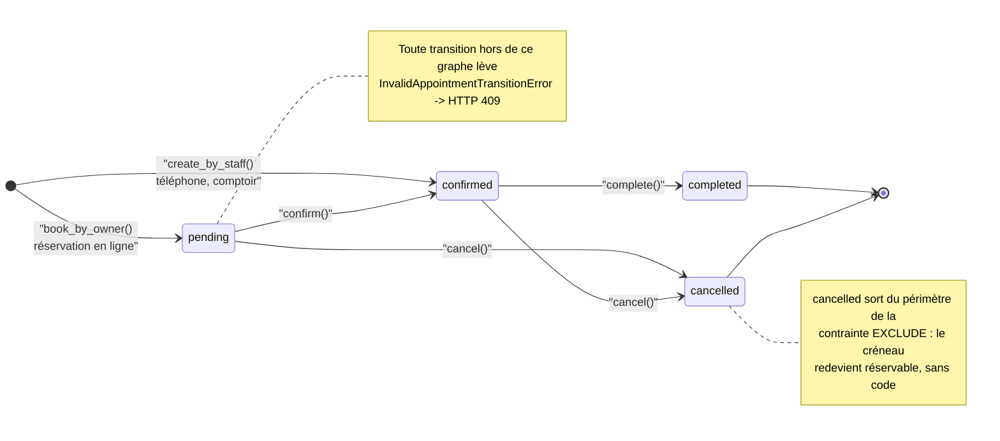

# Cycle de vie d'un rendez-vous

Un rendez-vous est l'entité la plus riche en règles du projet. Elle est modélisée comme
une **machine à états stricte** : les transitions valides sont énumérées, et **toute
autre lève une erreur métier**.

## Les quatre états

| État        | Signification                                                          |
| ----------- | ---------------------------------------------------------------------- |
| `pending`   | Demande faite en ligne par un propriétaire, en attente de confirmation |
| `confirmed` | La clinique a validé — le rendez-vous aura lieu                        |
| `completed` | La consultation a eu lieu                                              |
| `cancelled` | Annulé, par le propriétaire ou par la clinique                         |

## Le graphe



## Deux naissances différentes, et pourquoi

C'est la subtilité la plus utile de ce modèle : un rendez-vous ne naît pas dans le même
état selon qui le crée.

```python
@classmethod
def book_by_owner(cls, ...) -> tuple["Appointment", AppointmentBooked]:
    """Reservation en ligne : nait PENDING + evenement pour l'outbox."""
```

Un propriétaire qui réserve en ligne émet une **demande**. La clinique garde la main :
elle peut avoir un imprévu, préférer un autre praticien, ou juger le motif inadapté au
créneau choisi.

Un rendez-vous créé **par le personnel** — au téléphone, au comptoir — naît directement
`confirmed`. La raison est évidente une fois formulée : la clinique n'a pas à se
confirmer à elle-même.

Les deux méthodes renvoient un **couple** `(entité, événement)`. Le domaine ne publie
rien lui-même ; il déclare ce qui vient de se produire, et c'est le UoW qui écrira
l'événement dans l'outbox au commit. Voir
[Événements et outbox](../architecture/evenements-et-outbox.md).

## Les transitions et leurs gardes

Chaque méthode vérifie l'état de départ avant d'agir :

```python
def confirm(self, now: datetime) -> AppointmentConfirmed:
    """pending -> confirmed (action de la clinique)."""
    if self.status is not AppointmentStatus.PENDING:
        raise InvalidAppointmentTransitionError(
            f"Impossible de confirmer un rendez-vous {self.status.value}."
        )
    self.status = AppointmentStatus.CONFIRMED
    return AppointmentConfirmed(...)
```

| Méthode             | De                       | Vers        | Émet                   |
| ------------------- | ------------------------ | ----------- | ---------------------- |
| `confirm()`         | `pending`                | `confirmed` | `AppointmentConfirmed` |
| `complete()`        | `confirmed`              | `completed` | —                      |
| `cancel()`          | `pending` ou `confirmed` | `cancelled` | `AppointmentCancelled` |
| `cancel_by_owner()` | idem, **si ≥ 24 h**      | `cancelled` | `AppointmentCancelled` |

`complete()` n'émet aucun événement : rien, aujourd'hui, ne doit se déclencher à la fin
d'une consultation. Le jour où la facturation arrivera, ce sera le point d'accroche
naturel.

`InvalidAppointmentTransitionError` est traduit en **`409 Conflict`** par la table
d'erreurs du contexte `scheduling`.

## La règle des 24 heures

```python
OWNER_CANCELLATION_MIN_NOTICE = timedelta(hours=24)


def cancel_by_owner(self, *, cancelled_reason: str | None, now: datetime):
    if self.starts_at - now < OWNER_CANCELLATION_MIN_NOTICE:
        raise CancellationTooLateError(
            "Ce rendez-vous commence dans moins de 24 heures : "
            "il ne peut plus etre annule en ligne."
        )
    return self.cancel(cancelled_reason=cancelled_reason, now=now, cancelled_by="owner")
```

C'est une règle métier assumée, pas une limitation technique : un désistement de dernière
minute doit passer par un appel, pour que la clinique puisse essayer de replacer le
créneau.

Elle ne s'applique **qu'au propriétaire**. Le personnel passe par `cancel()`, sans
préavis — la clinique doit pouvoir annuler une matinée entière en cas d'urgence.

Notez que `now` est un **paramètre**, jamais un `datetime.now()` interne. C'est le port
`Clock` qui le fournit, ce qui permet de tester la règle en figeant le temps plutôt qu'en
faisant dépendre le résultat de la date d'exécution de la suite.

## Annuler libère le créneau, gratuitement

`cancel()` ne fait que changer le statut. C'est la contrainte de base qui produit
l'effet :

```sql
EXCLUDE USING gist (resource_id WITH =, tstzrange(starts_at, ends_at) WITH &&)
WHERE (status IN ('pending', 'confirmed'))
```

Un rendez-vous `cancelled` **sort du périmètre** du `WHERE`. Il cesse donc d'être
considéré pour le calcul de chevauchement, et le créneau redevient réservable — sans
suppression de ligne, sans tâche de nettoyage, sans risque d'oubli.

Le même raisonnement vaut pour le calcul des créneaux disponibles : la projection des
périodes occupées ne retient que les statuts actifs. Voir
[Calcul des créneaux](calcul-des-creneaux.md).

## L'identité du client : propriétaire **ou** invité

Un rendez-vous appartient soit à un compte propriétaire (`owner_id`, avec `pet_id`
optionnel), soit à un **client de passage** sans compte (`guest_name`, saisi par le
personnel). L'invariant est vérifié **deux fois** :

```python
def __post_init__(self) -> None:
    if self.ends_at <= self.starts_at:
        raise DomainValidationError("La fin du rendez-vous doit etre apres son debut.")
    # Miroir du CHECK SQL ck_appointments_owner_or_guest.
    if self.owner_id is None and self.guest_name is None:
        raise DomainValidationError(
            "Un rendez-vous doit avoir un proprietaire ou un nom de client."
        )
```

Le doublon domaine/SQL est intentionnel : le domaine donne un message d'erreur utile et
un test rapide, la contrainte SQL garantit qu'aucune écriture ne peut la contourner —
script de reprise, correction manuelle ou futur point d'entrée.
